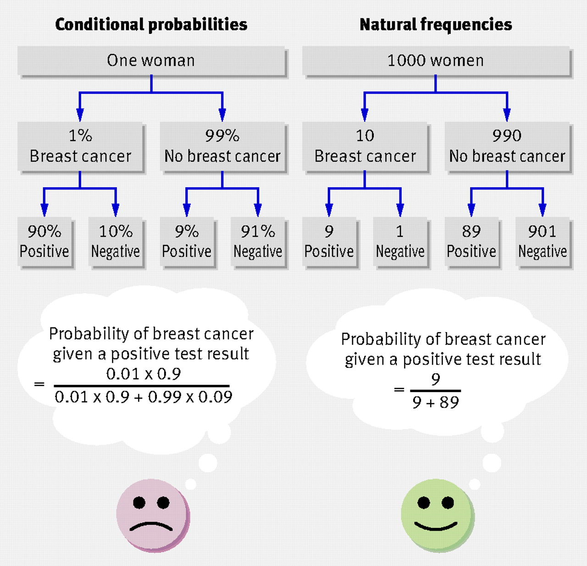

```{css, echo = F}
body{
  font-family: Helvetica;
  font-size: 16pt;
  max-width: 1000px;
  margin: auto;
  margin-left:310px;
}
pre{
  font-size: 20px;
}
/* Headers */
h1{
    font-size: 24pt;
  }
h1,h2{
    font-size: 20pt;
  }
h3,h4,h5,h6{
  font-size: 18pt;
}

#TOC {
  position: fixed;
  left: 0;
  top: 0;
  width: 300px;
  height: 100%;
  overflow:auto;
}
```

```{r setup, include=FALSE, echo = FALSE}
knitr::opts_chunk$set(echo = TRUE, dpi = 300, fig.align = 'center')
```

```{r, include=FALSE, message=FALSE, warning=FALSE, results='hide'}
library(plotrix)
draw_pie = function() {
  par(mar = c(0,0,0,0))
  pie(c(3,1), labels = "", border = "white")
  draw.circle(0,0,.8)
}
e.rot = 45
h.e = .25
k.e = -.25
a.e = .5
b.e = .175
draw_ellipse = function() {
  draw.ellipse(h.e,k.e,a.e,b.e , angle = e.rot,
               col = adjustcolor("grey",alpha = .75),
               border = adjustcolor("grey",alpha = .75)) 
}
colored.hist = function(data, lower = NULL, upper = NULL, length.out = 51, main = "", color1 = "blue", color2 = "grey") {
  if(is.numeric(main)) main=round(main,4)
  if(is.null(lower) & is.null(upper)) color1 = "grey"
  h = hist(data, breaks = seq(0,1,length.out = length.out), plot = F)
  cols = rep(color1,length(h$breaks))
  if (!is.null(lower)) cols[h$breaks < lower] = color2
  if (!is.null(upper)) cols[h$breaks > upper] = color2
  plot(h, col = cols, main = main, xlab = "samples",border = NA)
}
par(mar=c(2.5,2.5,0,1), mgp=c(2,.7,0), tck=-.01)
library(rethinking)
```


## Probability concepts

- Unconditional or marginal probability $P(A)$: The probability of an event independent of the state of related events
- Joint probability $P(A,B)$ or $P(A \textrm{ and }  B)$ or  $P(A \cap B)$: The probability that two events co-occur
- Conditional probability $P(A|B)$: The probability that one event occurs given that we have fixed a related event to a specific value


Example: We want to make statements about winter days and snow days. This means that there are 4 possible event types:

$$
\begin{alignat}{2}
\text{no winter} &\; \cap \;  \text{no snow} \\
\text{winter}    &\; \cap \;  \text{no snow} \\
\text{no winter} &\; \cap \;  \text{snow} \\
\text{winter}    &\; \cap \;  \text{snow}
\end{alignat}
$$
We can visualize the probability that any given day falls into one of these for classes as follows.

```{r, echo = F}
draw_pie()
draw_ellipse()
legend("topleft",
       fill = c("white","lightblue2",adjustcolor("grey",alpha = .75),"lightblue3"),
       legend = c(
         expression(no~winter ~ intersect(no~snow)),
         expression(winter ~ intersect(no~snow)),
         expression(no~winter ~ intersect(snow)),
         expression(winter ~ intersect(snow))),
       bty = "n")
```

Marginal probabilities are just the probabilities of event, independent of anything else

```{r, echo = F}
par(mfrow = c(1,2))
draw_pie()
title("Marginal probability\nP(winter)", line = -3)
draw_pie()
draw.circle(0,0,.8, col ="white")
draw_ellipse()
title("Unconditional probability\nP(snow)", line = -3)
```

The joint probability can be visualized as the intersection of bot event types winter and snow:

```{r, echo = F}
par(mar = c(0,0,0,0))
pie(c(3,1), labels = "")
draw.circle(0,0,.8, col ="white")
draw.ellipse(h.e,k.e,a.e,b.e , col = "lightblue", angle = e.rot, border = "lightblue")
draw_ellipse()
rect(0,0,.7,.2, col = "white", border = NA)
rect(0,0,-.2,-.7, col = "white", border = NA)
title("Joint probability", line = -1)
title(expression(P(winter ~ intersect(snow))), line = -2)
```

Finally, the conditional probability fixes one event type to a specific value, and asks "Given we fixed this first event type, what is the probability of the second even type." We are focusing only on this subset off all possible event types:

```{r, echo = F}
par(mar = c(0,0,0,0))
pie(c(3,1), labels = "", border = "white")
draw_ellipse()
rect(0,0,.7,.2, col = "white", border = NA)
rect(0,0,-.2,-.7, col = "white", border = NA)
```

And the conditional probability is then just the joint probability  relative to (divided by) the probability of the first, fixed event type.

```{r, echo = F}
```{r, echo = F}
par(mar = c(0,0,0,0), mfrow = c(2,1))


pie(c(3,1), labels = "", ylim = c(0,-.5))
draw.circle(0,0,.9, col ="white", lty = 3, border = "grey")
draw.ellipse(h.e,k.e,a.e,b.e , col = "lightblue", angle = e.rot, border = "lightblue")
draw_ellipse()
rect(0,0,.7,.2, col = "white", border = NA)
rect(0,0,-.2,-.7, col = "white", border = NA)

title(expression(P(snow~"|"~winter)~"="~frac(P(winter ~ intersect(snow)),P(winter))), line = -3)


pie(c(3,1), labels = "", border = "white")
draw.circle(0,0,.8, lty = 3, border = "grey")
lines(c(-1,1),c(1,1), lwd = 2)
```


```{r, echo = F}
shift_rotate = function(xy,shift_x, shift_y, angle) {
  theta = 2*pi/(1/(angle/360))
  trans.mat = transf = matrix(c(cos(theta),-sin(theta),sin(theta),cos(theta)),nrow = 2)
  
  x.e = xy[1] - shift_x
  y.e = xy[2] - shift_y
  
  xy_transf = trans.mat %*% matrix(c(x.e,y.e))
  
  return(xy.r = c(
    x.r = shift_x + xy_transf[1],
    y.r = shift_y + xy_transf[2]  
  ))
}

in_ellipse = function(xy,h,k,a,b, e.rot) {
  xy.r = shift_rotate(xy,h,k,e.rot)
  (xy.r[1]-h)^2/a^2 + (xy.r[2]-k)^2/b^2 <= 1
}

rpoint_in_circle = function() {
  r = 0.8 * sqrt(runif(1))
  theta = runif(1) * 2 * pi
  return(c(0 + r * cos(theta),
           0 + r * sin(theta)))
}
```

If we use simulations to calculate these probabilities, as illustrated in the next figure, the problem is reduced to simple counts:

$$
P(snow|winter) = \frac{\text{number of snowy winter days}}{\text{number of winter days}}
$$

```{r, echo = F}
set.seed(123)
draw_pie()
draw_ellipse()

N = 365
is.winter = vector(length = N) # vector to count winter days
is.snow = vector(length = N) # vector to count snow days

for (k in 1:N) {
  # generate random point with custom function
  xy = rpoint_in_circle()
  
  # check if it is a snow day, i.e. in ellipse, with custom function
  is.snow[k] = in_ellipse(xy,h.e,k.e,a.e,b.e,e.rot)
  # check if it is a winter day
  is.winter[k] = xy[1] > 0 & xy[2] < 0
  
  # plot points
  points(xy[1],xy[2],
         pch = ifelse(is.snow[k] == T,8,21), cex = .75,
         bg = ifelse(is.winter[k] == T,"blue","red"),
         col = ifelse(is.winter[k] == T,"blue","red"))

}

legend(.75,.8,
       pch = c(8,21,15,15), bty = "n",
       col = c("black","black","blue","red"),
       legend = c("snow","no snow", "winter", "no winter"))
```

Here is the whole thing with A and B instead of snow and winter.

$$
\overset{\color{violet}{\text{conditional probability}}}{P(A|B)} = \frac{\overset{\color{red}{\text{joint probability}}}{P(A, B)}}{\overset{\color{blue}{\text{marginal probability}}}{P(B)}}
$$
and by multiplying with $P(B)$ on both sides, we get first 

$$
\overset{\color{violet}{\text{conditional probability}}}{P(A|B)} \cdot \overset{\color{blue}{\text{marginal probability}}}{P(B)} = \overset{\color{red}{\text{joint probability}}}{P(A,B)}
$$

which is the same as

$$
\overset{\color{red}{\text{joint probability}}}{P(A,B)} = \overset{\color{violet}{\text{conditional probability}}}{P(A|B)} \cdot \overset{\color{blue}{\text{marginal probability}}}{P(B)}
$$

This is the general product rule (or chain rule) that connects conditional probabilities with joint probabilities.


## Deriving Bayes rule


$$
P(A,B) = \color{blue}{P(A|B) \cdot P(B)} \\
P(A,B) = \color{red}{P(B|A) \cdot P(A)}
$$

Because both equations have $P(A,B)$ on the left hand side, we can also write

$$
\color{blue}{P(A|B) \cdot P(B)} = \color{red}{P(B|A) \cdot P(A)}
$$

If we want to know what $P(A|B)$ is, we now have to divide on both sides with $P(B)$, which gives us

$$
\color{blue}{P(A|B)} = \frac{\color{red}{P(B|A) \cdot P(A)}}{\color{blue}{P(B)}}
$$

This is Bayes Rule, which one uses to calculate the inverse conditional probability, i.e. when we have information about the probability of $B$ given $A$ ($P(B|A)$) and want to calculate the probability of $A$ given $B$ ($P(A|B)$).


Chapter 3 also introduces a diagnostic example. More generally we can ask the question about what is the probability of a disease given a positive test results $P(D|T+)$.


$$
P(D|T+) = \frac{P(T+|D)\cdot P(D)}{P(T+)}
$$

This tells us the that probability of disease also depends of the unconditional probability (base rate) of the disease and of positive tests.

Sometimes, Bayes rule is expressed in a more complicated manner, if one adds how to calculate $P(T+)$, which is 
$$
P(T+|not D)\cdot P(notD) + P(T+|D)\cdot P(D)
$$
However, this is not so relevant for Bayesian inference.

Because this last expression is so complicated, natural frequencies are popular with some




## What are probability distribution, and where do we need them for Bayesian statistics?

Probability distributions are a special form of functions. Here are some functions you have probably already encountered. 

```{r, echo = F, fig.width=8, fig.height=8}
par(mfrow = c(2,2))
plot(seq(-3,3,.1), 
     seq(-3,3,.1)^2,
     pch = ".", 
     xlab = "x",
     ylab = "f(x) = f(x)",
     bty = "n", main = "Qudratic function")
text(0,6,expression(f(x)~"="~x^2))
plot(seq(0,pi*2,.1), 
     sin(seq(0,pi*2,.1)),
     pch = ".", 
     xlab = "x",
     ylab = "y = f(x)",
     bty = "n", main = "Sine function")
text(5,.5,expression(f(x)~"="~sin(x)))
plot(seq(0,10,.1), 
     3 + 0.5 * seq(0,10,.1),
     pch = ".", 
     xlab = "x",
     ylab = "y = f(x)",
     bty = "n", main = "linear regression function")
text(2,7,expression(f(x)~"="~a+b*x))
plot(seq(-3,3,.1), 
     dnorm(seq(-3,3,.1)),
     pch = ".", 
     xlab = "x",
     ylab = "y = f(x)",
     main = "Normal distribution function",
     bty = "n")
text(0,.1, expression(f(x)~"="~frac(1,sigma~sqrt(2~pi))~e^{-frac(1,2)~(frac(x-mu,sigma))^2}))
```


In Bayesian statistics, we use such distributions to express three things:

1. <span style="color:blue">**Prior**</span> judgement about the probability of different parameter values before seeing the data. 
2. The probability of different parameter values given the data. This is also called the <span style="color:red">**likelihood**</span>
3. The <span style="color:violet">**posterior probability**</span> of different parameter values given our prior judgement and the data.

Let's walk through a simple example. We start by describing our prior judgement, that we are slightly confident that that index finger touches water rather than land, with the beta distribution.

What is the posterior probability of land, given 10 W and 3 L tosses?

First we define a grid and plot a the prior "probability" values:

```{r class.source = 'fold-show', out.width="75%"}
p_grid = seq(0,1,by = .05)
prior = dbeta(p_grid,2,1)
plot(p_grid, prior, type = "h", col = "blue",
     ylab = "density", main = "Prior")
```

Vertical lines indicate the prior plausibility for parameter values in the grid.

Next we calculate the likelihood, i.e. the probability of the data given the model (a binomial distribution), the data (3 W, 3 L) and the parameter p (in p_grid):

```{r class.source = 'fold-show', out.width="75%"}
likelihood = dbinom(10,13,p_grid)
plot(p_grid, likelihood, type = "h", col = "red",
     ylab = "density", main = "Likelihood")
```

Vertical lines indicate the plausibility of the data for the parameter values in the grid.

And now we can calculate the un-normalized posterior as a product of prior and likelihood:

```{r class.source = 'fold-show', out.width="75%"}
posterior = prior * likelihood
plot(p_grid, posterior, type = "h", col = "violet", 
     ylab = "density", main = "Posterior")
```

Vertical lines indicate the posterior plausibility of the parameter values in the grid, given the data and the prior.

Here is a plot with all three together:

```{r, out.width="75%"}
par(mar = c(5.1,4.1,1,2.1))
ylim = c(0,max(c(likelihood,posterior,prior)))
plot(p_grid, prior, type = "h",col = "blue", 
     ylab = "density", ylim = ylim)
lines(p_grid+.01, likelihood, type = "h", col = "red")
lines(p_grid-.01, posterior, type = "h", col = "violet")
legend("topleft",col = c("blue","red","violet"),
       lty = 1, legend = c("Prior","Likelihood","Posterior"), 
       bty = "n")
```

We can make the plot easier to view by normalizing all values so that they sum up to 1 for prior, likelihood and posterior.
In each distribution, only the relative values at the different points of the grid are relevant!

```{r class.source = 'fold-show', out.width="75%"}
n_prior = prior/sum(prior)
n_likelihood = likelihood/sum(likelihood)
n_posterior = posterior/sum(posterior)
```

```{r out.width="75%", echo = FALSE}
n_ylim = c(0,max(c(n_likelihood,n_posterior,n_prior)))
par(mar = c(5.1,4.1,1,2.1))
plot(p_grid, n_prior, type = "h", col = "blue", 
     ylab = "normalized density", ylim = n_ylim)
lines(p_grid+.01, n_likelihood, type = "h", col = "red")
lines(p_grid-.01, n_posterior, type = "h", col = "violet")
legend("topleft",col = c("blue","red","violet"),
       lty = 1, legend = c("Prior","Likelihood","Posterior"), 
       bty = "n")
```


Here, we have information about priors only at relatively few points. Lets increase the resolution of the grid:

```{r out.width="75%"}
fp_grid = seq(0,1,by = .02)
f_prior = dbeta(fp_grid,2,1)
f_likelihood = dbinom(10,13,fp_grid)
f_posterior = f_prior * f_likelihood

f_prior = f_prior/sum(f_prior)
f_posterior = f_posterior/sum(f_posterior)
f_likelihood = f_likelihood/sum(f_likelihood)
f_ylim = c(0,max(c(f_likelihood,f_posterior,f_prior)))

par(mar = c(5.1,4.1,1,2.1))
plot(fp_grid, f_prior, type = "h", col = "blue",
     ylab = "normalized density", ylim = f_ylim)
lines(fp_grid+.005, f_likelihood, type = "h",col = "red")
lines(fp_grid-.005, f_posterior, type = "h", col = "violet")
legend("topleft",col = c("blue","red","violet"),
       lty = 1, legend = c("Prior","Likelihood","Posterior"), 
       bty = "n")
```

This display gets quickly hard to read. Because we also know that the plausibility of parameter values is similar to the plausibility of adjacent parameter values, we can draw an outline instead of many vertical lines:

```{r out.width="75%"}
fp_grid = seq(0,1,by = .01)
f_prior = dbeta(fp_grid,2,1)
f_likelihood = dbinom(10,13,fp_grid)
f_posterior = f_prior * f_likelihood

f_prior = f_prior/sum(f_prior)
f_posterior = f_posterior/sum(f_posterior)
f_likelihood = f_likelihood/sum(f_likelihood)
f_ylim = c(0,max(c(f_likelihood,f_posterior,f_prior)))

par(mar = c(5.1,4.1,1,2.1))
plot(fp_grid, f_prior, type = "l", col = "blue",
     ylab = "normalized density", ylim = f_ylim)
lines(fp_grid, f_likelihood, type = "l",col = "red")
lines(fp_grid, f_posterior, type = "l", col = "violet")
legend("topleft",col = c("blue","red","violet"),
       lty = 1, legend = c("Prior","Likelihood","Posterior"), 
       bty = "n")
```


## Ways to calculate the posterior

### Grid approximation

- We calculate the posterior probability for a number of prior probability values. 

This works if we have a limited number of parameters.

To get samples from this probability distribution, we use the posterior probabilities as weights when we sample from the prior values for which we calculate the posterior.

### Quadratic (Laplace) approximation

- We find the mode of the posterior distribution, which is also called the maximum a posteriori or MAP^[with some optimization scheme]  
- We use the curvature at this mode^[How quickly the posterior changes if one moves away from the mode] to approximate how the entire posterior distribution looks like. 

This works if the posterior distribution has a (multivariate) normal distribution. (Which also means that it has only one mode)

To get samples we simulate from the (multivariate) normal distribution that describes the posterior.

### Markov Chain Monte Carlo (MCMC)

- A simulation based approach

Also works for non-normal and multi-modal posterior distributions, but needs more time.

MCMC directly produces samples.

## Learning things from the posterior 

The posterior distribution contains all our knowledge given the prior, model, and data. If possible, we should show the reader the full posterior. If the posterior distribution has a simple shape, which is often the case, we can calculate certain statistics to summarize the posterior.

We walk through some concepts with the following posterior.

```{r, echo = F}
samples1 = rbeta(500000,10,2.5)
colored.hist(samples1, length.out = 250)
```

I prefer histograms over density plots, because density plots can distort things

### Mean, median, and mode
```{r, echo = F, messsage = FALSE, warning=FALSE, results='hide'}
colored.hist(samples1, length.out = 250)
mode = mean(HPDI(samples1,.1))
clrs = c("red","blue","black")
abline(v = c(mean(samples1),median(samples1),mode), col = clrs, lwd = 2)
legend("topleft",
       lty = 1, lwd = 2,
       col = clrs,
       legend = c("mean","median","mode"),
       bty = "n")
```

### Quintiles

```{r}
Q05 = quantile(samples1,.05)
colored.hist(samples1, length.out = 250, upper = Q05)
```


### Credible intervals

An x% credible interval (CI) is the central interval that contains x% of the posterior distribution

Can also be called posterior intervals. This is what some people think confidence intervals are.

```{r}
CI80 = PI(samples1, prob = .8)
colored.hist(samples1, length.out = 250,
             lower = CI80[1],
             upper = CI80[2])
title(paste("Interval length = ",round(diff(CI80),3)))
abline(v = CI80, lwd = 2, col  = "blue")
text(CI80, c(6000,6000), labels = round(CI80,2), pos = c(2,4), col = "blue")
```

Credible intervals are calculated with quintiles. For instance, if the 80% credible intervals goes from the 10% ((100-80)/2) quintile to the 90% quintile.

### Highest density posterior interval

An x% Highest density posterior interval (HDPI) is the shortest interval that contains x% of the posterior distribution. 

```{r}
HPDI80 = HPDI(samples1, prob = .8)
colored.hist(samples1, length.out = 250, color1 = "violet",
             lower = HPDI80[1],
             upper = HPDI80[2])
title(paste("Interval length = ",round(diff(HPDI80),3)))
abline(v = HPDI80, col = "violet", lwd = 2)
abline(v = CI80, col = "blue", lwd = 2, lty = 3)
text(CI80, c(6000,6000), labels = round(CI80,2), pos = c(2,4), col = "blue")
text(HPDI80, c(4000,4000), labels = round(HPDI80,2), pos = c(2,4), col = "violet")
```

### Posterior predictions

How do we know that our model is any good?

In the workflow of Bayesian data analysis, we check "model fit" visually, by comparing if the predictions made by the model are consistent with the data.

We do this by taking parameters from the posterior distribution, and then simulate data from the model with these parameters.

If the model and parameters are good, the simulated data should look similar to the observed data.

Lets look at some more globe tosses: We get 13 out of 20 tosses water.
```{r class.source = 'fold-show'}
n_water = 13
n_total = 20
p_grid = seq(0,1,.01)
prior = rep(1,length(p_grid))
likelihood = dbinom(n_water, n_total, prob = p_grid)
posterior = prior*likelihood
posterior = posterior / sum(posterior)
plot(p_grid,posterior,'l',
     main = "Posterior distribution for the proportion of water")
```

To simulate data from our posterior distribution, we have to use the posterior probabilities of the parameter values. Lets first simulate 1000 simulated data sets, i.e. number of water tosses, using the median of the posterior:

```{r class.source = 'fold-show'}
# generate samples from the posterior distribution
posterior_samples = sample(p_grid,1000, prob = posterior, replace = TRUE)
# simulate data given the median of the 
# posterior distribution for proportion of water
predictions.point = rbinom(1000,n_total, prob = median(posterior_samples))
simplehist(
  predictions.point, 
  xlab = "# predicted water tosses",
  main = "Posterior predictive distribution from median")
points(n_water,0, col = "red", pch = 16, cex = 2)
```

The random process involved in simulating the data (we repeatedly toss 10 biased coins) makes that our posterior predictions are variable even if we always use the same (median) probability.

However, in a Bayesian approach, we do use a point estimates of parameters to generate posterior predictions, but the full posterior distribution.

```{r}
predictions.dist = rbinom(1000,n_total, prob = posterior_samples)
simplehist(
  predictions.dist,
  ylim = c(0, max(table(predictions.point))),
  col = "blue",
  xlab = "# predicted water tosses",
  main = "Posterior predictive distribution")
lines(as.numeric(names(table(predictions.point)))+.1,
      table(predictions.point), type ="h", lwd = 3)
points(n_water,0, col = "red", pch = 16, cex = 2)
legend("topleft",
       bty = "n",
       col = c("blue","black"), lty = 1, lwd = 3,
       title = "Predictions from posterior",
       legend = c("distribution",
                  "median"))
```

The uncertainty described by the full posterior distribution is reflected in a somewhat wider posterior predictive distribution.

Now lets redo the analysis, but instead of using the binomial distribution we use another distribution for integer data, the poisson distribution. The sole parameter of the poisson distribution is the mean number of expected counts.

```{r class.source = 'fold-show'}
m_grid = seq(0,40,.1)
prior = rep(1,length(m_grid))
likelihood = dpois(n_water, lambda = m_grid)
posterior = prior*likelihood
posterior = posterior / sum(posterior)
plot(m_grid,posterior,'l',
     main = "Posterior distribution for expected water tosses.")
```

We can already see that something is not right here. Lets generate posterior predictions:

```{r class.source = 'fold-show'}
# generate samples from the posterior distribution
posterior_samples = sample(m_grid,1000, prob = posterior, replace = TRUE)
# simulate data given the median of the 
# posterior distribution for proportion of water
predictions.dist = rpois(1000,posterior_samples)
simplehist(
  predictions.dist, xlab = "# predicted water tosses",
  main = "Posterior predictive distribution from 'wrong' model.")
points(n_water,0, col = "red", pch = 16, cex = 2)
abline(v = 20.5, lty = 3, col = "magenta")
```

These posterior predictions are clearly incompatible with the data, because they allow for impossible values of 11 or more water tosses, even though our sample size is only 10.

