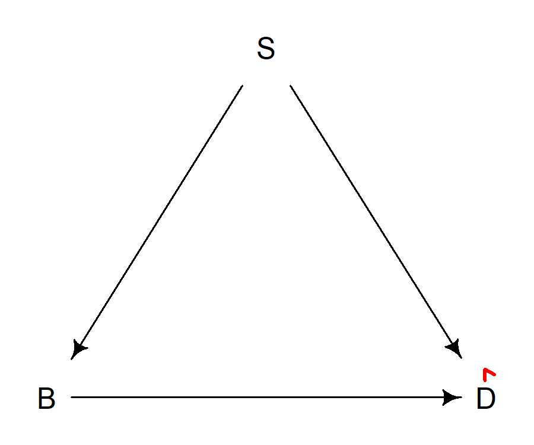
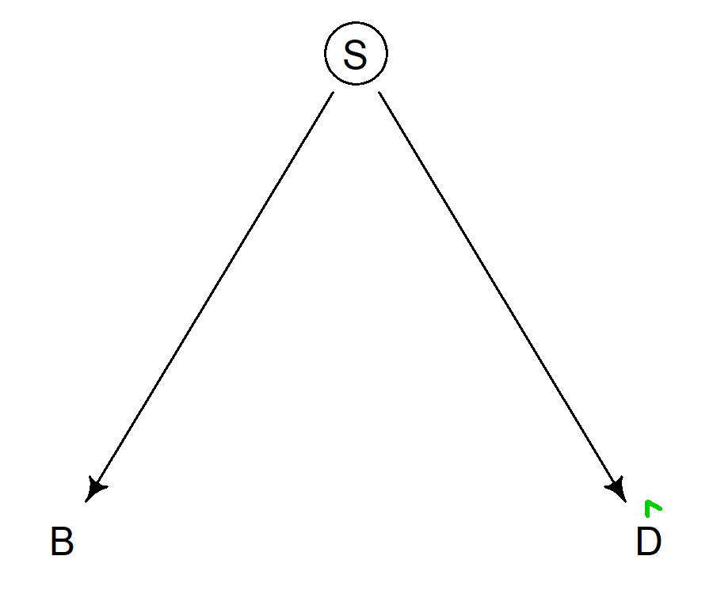
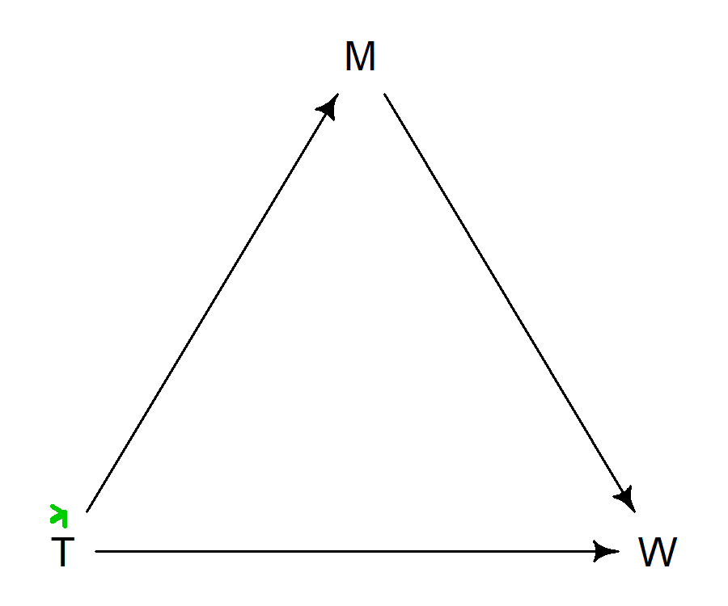
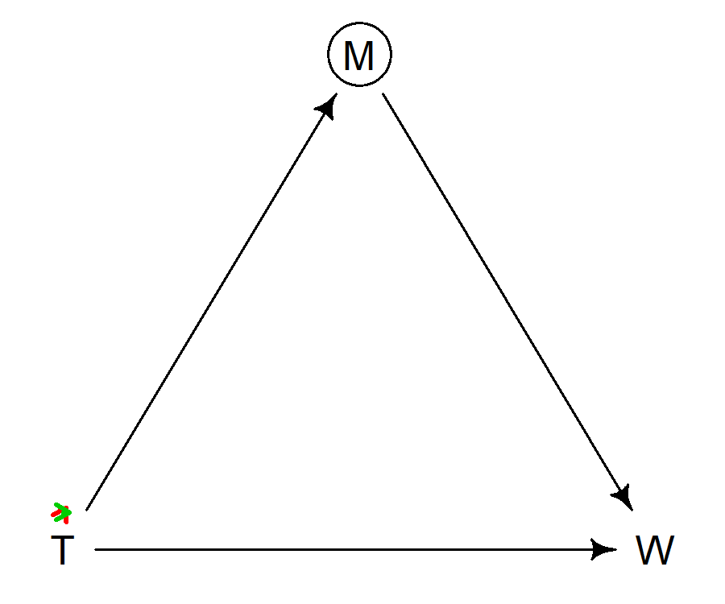
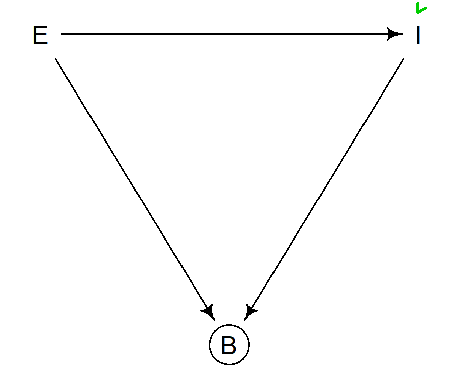
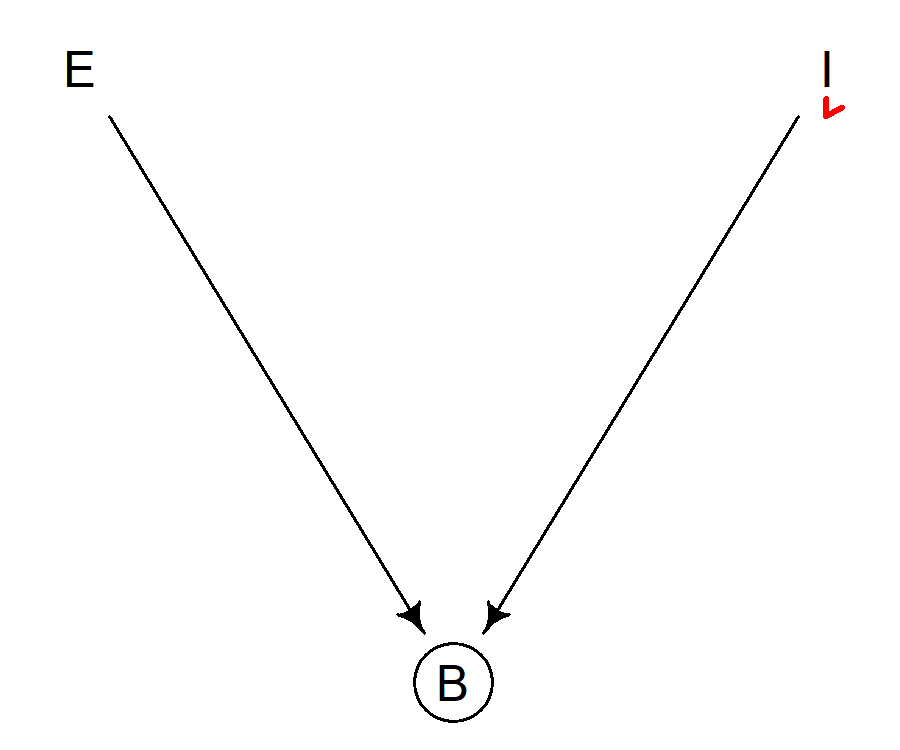

  
```{css, echo = F}
body{
  font-family: Helvetica;
  font-size: 16pt;
  max-width: 1000px;
  margin: auto;
  margin-left:310px;
}
pre{
  font-size: 20px;
}
/* Headers */
h1{
    font-size: 24pt;
  }
h1,h2{
    font-size: 20pt;
  }
h3,h4,h5,h6{
  font-size: 18pt;
}

#TOC {
  position: fixed;
  left: 0;
  top: 0;
  width: 300px;
  height: 100%;
  overflow:auto;
}
```

```{r setup, include=FALSE, message=FALSE, warning=FALSE, results='hide'}
knitr::opts_chunk$set(echo = TRUE, dpi = 300, global.par = TRUE)
library(plotrix)
library(DescTools)
library(rethinking)
library(magrittr)
library(knitr)
library(kableExtra)
library(psych)
library(MASS)
library(png)
library(dagitty)
library(smoother)
library(magick)
source("dag_utils.R")
```

```{r, echo = F}
par(mar=c(3,3,0,1), mgp=c(1,.5,0), tck=-.01)
```


# Directed acyclic graphs

Directed acyclic graphs are the brain child of computer scientist Judea Pearl, who developed them to reason systemically about causal inference. Judea Pearl's [The Book of Why](https://en.wikipedia.org/wiki/The_Book_of_Why) provides an accessible introduction to directed acyclic graphs and makes for a nice holiday reading.


DAGs are build from two types of components:

- Nodes, which represent variables
- Edges, which represent relationships between variables

All graphs are made of nodes and edges. What is special about directed acyclic graphs is that 

1. the relationship between two variables has a direction, such that 
    - variables at the start of the arrows are causes and 
    - variables at the end are effects 
2. a succession of arrows must not form a circle, that is, a variable cannot cause itself, even indirectly^[If one has multiple measurements of the same variable over time, each measurement would be a new node]. For example, $\small D\rightarrow B\rightarrow C\rightarrow D$ is not allowed.

# Bias

One important use case for DAGs is to determine which variables need to be involved if one wants to estimate the causal effect of one variable on the other. The underlying message here is that is we want to understand (causal) relationships between variables, we should not choose statistical models based on goodness of fit or related model selection criteria like AIC, BIC, RMSEA, TIL ..., but based on our knowledge about the about the data generating process. This knowledge can be simply domain knowledge, but it might also be be gained from data by investigating implied conditional independencies.

Due to it's reliance on observational data, the epidemiological literature on bias is much richer than the psychological literature. Here, **bias means that an association or causal effect we estimate from data ($\hat y$) diverges from the true association or causal effect that we are interested in ($y$), that is $bias = \hat y - y$ **. 

Such biases generally occur if either our analysis model is in conflict with the data generating process, or if we estimate an effect using a non-random sub-set of the data. Here are the most well-known biases:

- confounding bias from missing adjustment for a common cause of exposure and outcomes 
- bias from adjustment of a mediator (post treatment variables)
- selection bias from conditioning on a collider or it's decedent.


# Confounding bias: Common cause of exposure and outcome

## Forks depict common causes

Two variables $\small X$ and $\small Y$ have a common cause if they both depend on the same third variable $\small C$. The DAG structure that visualizes a common cause is called a _fork_:


```{r fig.height=1.25, fig.width=1.5, fig.align = 'center'}
fork = dagitty(
  "dag{
  C->X;
  C->Y;
  }")
coord.list = 
  list(
    x=c(X=0,Y=2,C=1),
    y=c(X=0,Y=0,C=-1))
coordinates(fork) = coord.list
drawmydag(fork)
```

Because both $\small X$ and $\small Y$ depend on $\small C$, they will be correlated, even if there is no direct effect of $\small X$ on $\small Y$ or vice versa.

## The backdoor

Imagine you want to investigate if the psychiatric disorder depression $\small D$  is caused by characteristics of brain structure $\small B$, e.g. grey matter volume. Your study sample has participants from both sexes $\small S$. As an expert clinical neuroscientist you know that 

- depression is more frequent among women and that 
- men are on average average taller and have therefor on average more grey matter volume. 

Hence, you draw the following DAG


```{r fig.height=1.25, fig.width=1.5, fig.align = 'center'}
C_dag = dagitty(
  "dag{
  S->B;
  S->D;
  }")
coord.list = 
  list(
    x=c(B=0,D=2,S=1),
    y=c(B=0,D=0,S=-1))
coordinates(C_dag) = coord.list
drawmydag(C_dag)
```

which indicates that  $\small S$ is a common cause of  $\small B$ and  $\small D$.

If we would now estimate the regression model 

$$
D_i \sim Normal(\alpha + \beta B_i, \sigma)
$$

we would see that $\small \beta$ is clearly different from zero, even if there is no causal effect of brain structure on depression.

This is due to a _backdoor_ path through which information can flow from $\small D$ to $\small B$. A backdoor path is an uninterrupted path that starts with an arrow pointing to the outcome of interest and that ends with and arrow pointing to the exposure. The following figure shows the backdoor path in red.

```{r fig.height=1.25, fig.width=1.5, fig.align = 'center'}
coord.list = coordinates(C_dag)
nodes = list(c("D","S"), c("S","B"))
x = get_xy(coord.list, nodes, "x")
y = -1*get_xy(coord.list, nodes, "y")
  
ys = smth.gaussian(y, tails = F)
ys[which(is.na(ys))] = y[which(is.na(ys))]
ys = ys + .05*3
drawmydag(C_dag)
plot_path(x,ys,length(x))
```

Confounding bias refers to the situation where we estimate the wrong relationship between two variables because we omit a common cause of the two variables from the regression model.

```{r fig.width=5, fig.height=5, fig.align = 'center'}
set.seed(12345)
N = 1000
S = rbinom(N,1,.5)
B = 0.5*S + scale(rnorm(N))
D = -0.5*S + scale(rnorm(N))
plot(D ~ B, col = 2-S)
legend("topleft", pch = 1, col = c("red", "black"), 
       legend = c("F","M"), bty = "white", bg = "white")
abline(lm(D~B))
title(expression(D%~%normal(alpha + beta[B]*B,sigma)))
```

## De-biasing by adjusting for a common cause

To obtain a correct estimate of the relationship between $\small B$ and $\small D$, we have to cut off the backdoor path.

To interrupt and open path, we can adjust for any (non-collider) variable on the open path. In DAGs, adjustment is typically symbolized by drawing a circle around the variable name: 

```{r fig.height=1.25, fig.width=1.5, fig.align = 'center'}
C_dag_A = C_dag
adjustedNodes(C_dag_A) = "S"
drawmydag(C_dag_A)
plot_path(x,ys,160, arrow.col = "green3")
```

Previously, we saw that we can think of the regression coefficient for $\small B$ after adjustment for $\small S$ as the coefficient we obtain if we use the residuals $\small B_r$ from the model $\small B_i \sim Normal(\alpha + \beta_S S_i, \sigma)$ as predictor:

```{r, fig.width=10, fig.height=5}
par(mfrow = c(1,2))
plot(D ~ B, col = 2-S)
abline(lm(D~B))
abline(coef(lm(D~B+S))[1:2], lwd = 2, col = "green3")
title(expression(D%~%normal(alpha + beta[B]*B + beta[S] * S,sigma)))
B_R = residuals(lm(B~S))
plot(D ~ B_R, col = 2-S, xlab = expression(B[R]))
abline(lm(D~B_R), lwd = 2, col = "green3")
title(expression(D%~%normal(alpha + beta[B[R]]*B[R],sigma)))
```

An alternative view point is that adjustment amounts to _conditioning_ the association between $\small B$ and $\small D$ on sex $\small S$, that is we estimate the association for the two sex groups separately:

```{r fig.width=5, fig.height=5, fig.align = 'center'}
plot(D ~ B, col = 2-S)
abline(lm(D[S == 0]~B[S == 0]), col = 2)
abline(lm(D[S == 1]~B[S == 1]), col = 1)
```

In sum: **If exposure and outcome have a common cause, this opens up a back-door path, which in turn leads to a biased estimate of the causal effect if one does not adjust for common cause. This common cause is typically called a confounder or confounding variable, and adjustment produces un-biased effects of causal estimates by closing the back-door path.^[Assuming the DAG depicts the true data generating process.]**

```{r echo = F}
if (!file.exists("C_dag_flow.gif"))
  flow_dag(C_dag,
         nodes = list(c("D","S"),
                      c("S","B")),
         arrow.col = "red",
         fn = "C_dag_flow.gif")
if (!file.exists("C_A_dag_flow.gif"))
flow_dag(C_dag_A,
         nodes = list(c("D","S")),
         arrow.col = "green3",
         fn = "C_A_dag_flow.gif",
         fps = 50)
```


Confounding bias             | De-biasing through adjustment
:-------------------------:|:-------------------------:
  |  

# Bias from adjustment of mediators

The strong focus on confounding as a main problem for (observational) studies has made that adding variables to a regression model is considered to be something positive. However, there are also _bad controls_, i.e. situations in which adding a variable to the regression model will lead to biased estimates.

## Pipes depict mediator variables

The effect of causes can be (partially or fully) mediated by auxiliary variables. Specifically, if we have the following _pipe_ structure, the effect of $\small Y$ on $\small X$ is fully mediated by $\small M$ because there is no other path from $\small Y$ to $\small X$ tat does not go via $\small M$. 

In experimental studies, post-treatment variables are variables that manifest after the treatment was delivered. Post-treatment variables have a higher likelihood to be mediators.

```{r fig.height=1.25, fig.width=1.5, fig.align = 'center'}
pipe = dagitty(
  "dag{
  X->M;
  M->Y;
  }")
coord.list = 
  list(
    x=c(X=0,Y=2,M=1),
    y=c(X=0,Y=0,M=-1))
coordinates(pipe) = coord.list
drawmydag(pipe)
```

## Adjusting for a bad control

Lets assume we are interested in the total effect of some treatment $\small T$ on wellbeing $\small W$. We have also collected some data about participants' motivation $\small M$ to get better, some time between treatment onset and the final wellbeing measurement. If we assume that 

- treatment has a direct effect on wellbeing, but also 
- an indirect effect via motivation

we can display the data-generating process as follows:


```{r fig.height=1.25, fig.width=1.5, fig.align = 'center'}
M_dag = dagitty(
  "dag{
  M->W;
  T->M;
  T->W
  }")
coord.list = 
  list(
    x=c(T=0,W=2,M=1),
    y=c(T=0,W=0,M=-1))
coordinates(M_dag) = coord.list
drawmydag(M_dag)
```


Here, we have two paths that lead from treatment to wellbeing:

```{r fig.height=1.25, fig.width=1.5, fig.align = 'center'}
flow_dag(
  M_dag,
  nodes = list(c("T","M"),
               c("M","W")),
  nodes2 = list(c("T","W")),
  arrow.col = "green3", cex = .75,
  p.offset = 3,
  animation = F)
```

However, adjusting for $\small M$ closes the indirect path:

```{r fig.height=1.25, fig.width=1.5, fig.align = 'center'}
M_dag_A = M_dag
adjustedNodes(M_dag_A) = "M"
flow_dag(M_dag_A,
         nodes = list(c("T","M")),
         nodes2 = list(c("T","W")),
         arrow.col = "red",
         arrow.col2 = "green3",  cex = .75,
         animation = F,
         p.offset = 3,
         length.out = 100)
```

We can regress $\small W$ on $\small T$ only and on $\small T$ and $\small W$ to illustrate how the total estimated effect becomes smaller if one adjusts for the mediator.

```{r fig.width=10, fig.height=5}
par(mfrow = c(1,2))
T = rnorm(N)
M = T + rnorm(N)
W = 0.125*T + 0.5*M + rnorm(N)
grayblue = colorRampPalette(c("grey","blue"))
plot(W~T, col = grayblue(N)[rank(M)], pch = 16)
abline(lm(W ~ T), col = "green3", lwd = 2)
title(expression(W%~%normal(alpha + beta[T]*T,sigma)))
legend("topleft",pch = 16, col = c("gray","blue"), 
       legend = c("low M", "high M"), bty = "n")
plot(W~T, col = grayblue(N)[rank(M)], pch = 16)
abline(coef(lm(W ~ T + M))[1:2], col = "red", lwd = 2)
title(expression(W%~%normal(alpha + beta[T]*T + beta[M]*M,sigma)))
```

As before, we display the effect of adjusting for $\small M$ by regressing on the residuals of T (the plot shows only a sub/set of the data points):

```{r, fig.width=10, fig.height=5}
T_R = residuals(lm(T~M))

par(mfrow = c(1,2))
idx = sample(N,200)
plot(T[idx],W[idx], col = "blue", ylab = "W", xlab = expression(T  %->% T[R]), pch = 16)
points(T_R[idx],W[idx], col = grayblue(100)[51])
arrows(x0 = T[idx], y0 = W[idx], x1  = T_R[idx],length = .075, col = "grey")
title(expression(T[R]~"="~T~-~alpha~+~beta[M]*M))

plot(W[idx] ~ T_R[idx], col = grayblue(100)[51],
     xlab = expression(T[R]), ylab = "W", xlim = range(T))
abline(lm(W~T_R), col = "red", lwd = 2)
title(expression(W%~%normal(alpha + beta[T[R]]*T[R],sigma)))
```
Note the direction of the arrows that depict how $\small T_R$ differs from $\small T$.


In sum: **If a variable $\small M$ lies on a path from the treatment $\small X$ to the outcome $\small Y$, such that the arrows points from the treatment to $\small M$ and from $\small M$ to the outcome ($\small T \rightarrow M \rightarrow Y$), we call this variable a mediator, and the corresponding structure a _pipe_. If one is interested in the total effect of $\small X$ on $\small Y$, one must _not_ adjust for $\small M$, because this would close the indirect path and thus lead to a biased estimation of the total effect.**

```{r echo = F}
if (!file.exists("M_dag_flow.gif"))
  flow_dag(M_dag,
         nodes = list(c("T","M"),
                      c("M","W")),
         nodes2 = list(c("T","W")),
         arrow.col = "green3",
         fn = "M_dag_flow.gif")
if (!file.exists("M_A_dag_flow.gif"))
flow_dag(M_dag_A,
         nodes = list(c("T","M")),
         nodes2 = list(c("T","W")),
         arrow.col = "red",
         arrow.col2 = "green3",
         fn = "M_A_dag_flow.gif",
         length.out = 100)
```

Mediation by M             | Bias from adjustment of mediator
:-------------------------:|:-------------------------:
  |  


# Selection bias from conditioning on a collider

Until now, we have discussed biases that emerge when our data is a random sample of the population, yet our analysis model is not consistent with the data generating process. Selection bias is a bit different, because it depends less on the analysis model and more on how or where we select participants into the study sample.^[Different fields associate different types of bias with the term selection bias. I use selection bias to refer to bias due to non-random selection of participants into the study sample. In contrast, econometrics uses selection bias to refer to non-random selection into treatment.]

## Colliders depict common consequences

If a variable $\small K$ depends on two variables $\small X$ and $\small Y$ we call $\small K$ a _common consequence_ of $\small X$ and $\small Y$. In a DAG, $\small K$ is a _collider_ variable between $\small X$ and $\small Y$.

```{r fig.height=1.25, fig.width=1.5, fig.align = 'center'}
collider = dagitty(
  "dag{
  X->K;
  Y->K;
  }")
coord.list = 
  list(
    x=c(X=0,Y=2,K=1),
    y=c(X=0,Y=0,K=1))
coordinates(collider) = coord.list
drawmydag(collider)
```

In such a simple structure, there is no open path between $\small X$ and $\small Y$, because the flow of information is blocked at a collider:

```{r echo = F}
if (!file.exists("collider_flow.gif"))
  flow_dag(collider,
         nodes = list(c("Y","K")),
         nodes2 = list(c("X","K")),
         arrow.col = "red",
         fn = "collider_flow.gif")
```

```{r fig.height=1.25, fig.width=1.5, fig.align = 'center'}
flow_dag(collider,
         nodes = list(c("Y","K")),
         nodes2 = list(c("X","K")),
         arrow.col = "green3",
         p.offset = 4,
         animation = FALSE)
```

## Bias from conditioning on a collider

Lets assume you are working in a BUP (Child and youth psychiatric division) and you want to learn about the relationship between internalizing problems ($\small I$, e.g. depression, anxiety) and externalizing problems ($\small E$, e.g. ADHD, oppositional behavior). To do this, you analyse  scores for internalizing and externalizing traits, which your BUP has collected for all children that were examined there.

The process that generated you data can be described along the following lines:

- You are not aware of any observed or unobserved common causes of $\small I$ and $\small E$.
- Based on domain knowledge, you do not think that $\small I$ causes $\small E$ or vice versa.
- For all children that are referred to the BUP the sum of $\small I$ and $\small E$ is relatively large. After all, only children with clearly noticeable problems are referred to an evaluation.

The data generating process we just described can be depicted with this DAG:

```{r fig.height=1.25, fig.width=1.5, fig.align = 'center'}
Cl_dag = dagitty(
  "dag{
  B [adjusted]
  I->B;
  E->B;
  }")
coord.list = 
  list(
    x=c(E=0,I=2,B=1),
    y=c(E=0,I=0,B=1))
coordinates(Cl_dag) = coord.list
drawmydag(Cl_dag)
```

Note that $\small B$ is circled, that is we are conditioning on $\small B$. We say that we are conditioning on $\small B$ because the data we observe are conditioned on children being observed in the BUP. Children who are not in the BUP are not observed. Put differently, if we code $\small B = 1$ for children observed in the BUP and $\small B = 0$ for children not observed, we are looking only at data were the value of $\small B$ is fixed so one, i.e. we are conditioning on $\small B$.

One important consequence of conditioning on $\small B$ is that the previously closed indirect path from $\small E$ to $\small I$ is now open. Generally, a collider variable closes a path and conditioning on a collider opens a path at the collider one conditioned on.

```{r fig.height=1.25, fig.width=1.5, fig.align = 'center'}
flow_dag(Cl_dag,
         nodes = list(c("I","B"),
                      c("B","E")),
         arrow.col = "red",
         p.offset = 4,
         animation = FALSE)
```

From this, we expect that if we simulate data from the DAG we described, we should find an association between $\small E$ and $\small I$ in the BUP sample, even when they are independent in the population. Let's check this:

```{r, fig.width=10, fig.height=5}
set.seed(12345)
I = rnorm(N)
E = rnorm(N)
B = (I + E) > rnorm(N,mean = 2)
I_s = I[B == TRUE]
E_s = E[B == TRUE]
par(mfrow = c(1,2))

plot(I_s ~ E_s, 
     xlim = range(I),
     ylim = range(E),
     ylab = expression(I["B=1"]),
     xlab = expression(E["B=1"]),
     pch = 16, col="grey75")
abline(lm(I_s~E_s), lwd = 2, col = "red")
title(expression(I %~% normal(alpha + beta * E,sigma)~"|"~"B=1"))

plot(I ~ E)
points(I_s ~ E_s, 
     pch = 16, col="grey75")
abline(lm(I~E), lwd = 2, col = "green3")
title(expression(I %~% normal(alpha + beta * E,sigma)))
```

In contrast to bias from adjustment with a mediator or bis from confounding, selection bias cannot be solved by adding or removing an adjustment variable. To deal with selection bias, methods based on propensity scores^[propensity score methods use auxiliary variables to calculate the probability that a participant is included in a sample or receives a treatment], like matching or weighting, need to be used. Note though that propensity score methods and especially weighting do not work naturally (some would say not at all) in the Bayesian framework.

In sum: **If a back-door path from exposure to outcome is closed by a collider and we condition on the collider or one of its descendant, this will lead selection bias. This bias is called selection bias, because conditioning on a collider describes a situation where only a non-random sub-set of the population is selected into the study sample.**

Selection bias should absolutely be considered at the study planning phase, because it will be challenging if not impossible to deal with selection bias if one does not plan to collect the relevant data.

```{r echo = F}
if (!file.exists("Cl_dag_flow.gif"))
  flow_dag(Cl_dag,
         nodes = list(c("I","B")),
         arrow.col = "green3",
         fn = "Cl_dag_flow.gif")
Cl_A_dag = Cl_dag
adjustedNodes(Cl_A_dag) = "B"
if (!file.exists("Cl_A_dag_flow.gif"))
flow_dag(Cl_A_dag,
         nodes = list(c("I","B"),
                      c("B","E")),
         arrow.col = "red",
         fn = "Cl_A_dag_flow.gif",
         fps = 50)
```


Collider            | Selection bias from conditioning on a collider
:-------------------------:|:-------------------------:
  |  


# Descendants

If a mediator, a confounder, or a collider has a descendant, adjustment of the descendant will have an effect in the same direction as adjustment of its parent, but the effect will be smaller. How much smaller depends on the strength of the parent-child association.

# Consider unobserved variables

I still need to find a good example that is different than in the book and holds for esimation of total effects


<!-- When thinking about DAGs it is often easier to think about variables one has measured.  -->

<!-- For instance, if we are interested in the effect of parental income $\small I_P$ on child mental health diagnosis $D$ it is easy to think about and measure parental education $\small E_P$ as a confounder -->

<!-- ```{r fig.height=1.25, fig.width=1.5, fig.align = 'center'} -->
<!-- C_dag =dagitty( -->
<!--   "dag{ -->
<!--   E_P -> I_P  -->
<!--   E_P -> D -->
<!--   }") -->
<!-- coord.list =  -->
<!--   list( -->
<!--     x=c(I_P=0,E_P=1, D=2,U=2), -->
<!--     y=c(I_P=0,E_P=-1,D=0,U=-1)) -->
<!-- coordinates(C_dag) = coord.list -->
<!-- drawmydag(C_dag) -->
<!-- ``` -->

<!-- If this DAG were a good model of the true data generating process, we could simply adjust for $\small E_P$ to obtain an unbiased effect estimate for $\small I_P$. -->

<!-- However, we could also think about other variables that play a role, and that are maybe harder to measure. For instance, parents social network $\small S_P$ could be an unobserved common cause of $\small E_P$ and $\small D$:  -->

<!-- ```{r fig.height=1.25, fig.width=1.5, fig.align = 'center'} -->
<!-- U_dag =dagitty( -->
<!--   "dag{ -->
<!--   S_P [unobserved] -->
<!--   E_P -> I_P  -->
<!--   E_P -> D -->
<!--   S_P -> E_P -->
<!--   S_P -> D -->
<!--   }") -->
<!-- coord.list =  -->
<!--   list( -->
<!--     x=c(I_P=0,E_P=1, D=2,S_P=2), -->
<!--     y=c(I_P=0,E_P=-1,D=0,S_P=-1)) -->
<!-- coordinates(U_dag) = coord.list -->
<!-- drawmydag(U_dag) -->
<!-- ``` -->


# Functional forms matter!

All models so far assumed a simple model of the form $\small \mu = \alpha + \beta X$. 

However, DAGs do not assume this specific relationship. If, for instance we have following DAG: 

```{r fig.height=1.25, fig.width=1.5, fig.align = 'center'}
fork2 = dagitty(
  "dag{
  C->X;
  C->Y;
  X->Y;
  }")
coord.list = 
  list(
    x=c(X=0,Y=2,C=1),
    y=c(X=0,Y=0,C=-1))
coordinates(fork2) = coord.list
drawmydag(fork2)
```

$\small \mu$ for $\small Y$ could be modeled as

$$
\mu = \alpha + \beta_X X + \beta_C C
$$

or with an nonlinear function

$$
\mu = \alpha + \beta_X X + \beta_C C^2
$$

or with an interaction

$$
\mu = \alpha + \beta_X X + \beta_{XC} (X * C)
$$


and other functions.


Successful adjustment depends on our adjustment model being close to the true data generating process.

# Excercise M2

If collinearity is a problem, depends on the question of interest and the reason for collinearity.

_Left:_ If collinearity is due to the correlation of the (distal) cause and a mediator, a regression that includes both variables will identify the correct direct effects. (Though it will underestimate the total effect of the distal cause.)

_Right:_ If collinearity is due to a common (unobserved) cause of 2 predictor variables, we cannot identify with high certainty the unique contribution of the two variables. A model that includes X1 and X2 provides us the conditional effects of both variables. But because both variables mediate the effect of the same unobserved variable, the conditional effect of X1 and X2 can be large or small, dependent on the value to which one fixes the other variable. The large standard error on the coefficients just reflects the fact that because X1 and X2 reflect the same process, we cannot say with high certainty to which value we should fix either X1 or X2 to fit the data as well as possible.


This is different if a model includes a distal cause and a mediator: Because only the mediator has a direct influence on the outcome, it is clearer to which value we need to fix M in order to fit the data well.

The take home message here is that we should worry less about colinearity and rather specify which effect we want to estimate and then use DAGs to find out if or under what circumstance we can estimate it.


```{r, fig.width=8, fig.height=4}
conf = dagitty(
  "dag{
  U [unobserved]
  U->X1;
  U->X2;
  X1->Y;
  X2->Y
  }")
coord.list = 
  list(
    x=c(U=0,X1=1, X2=1,Y=2),
    y=c(U=0,X1=-1,X2=1,Y=0))
coordinates(conf) = coord.list
par(mfrow = c(1,2))
drawmydag(pipe, cex = 2, lwd = 2)
drawmydag(conf, cex = 2, lwd = 2, radius = 5.5)
```
