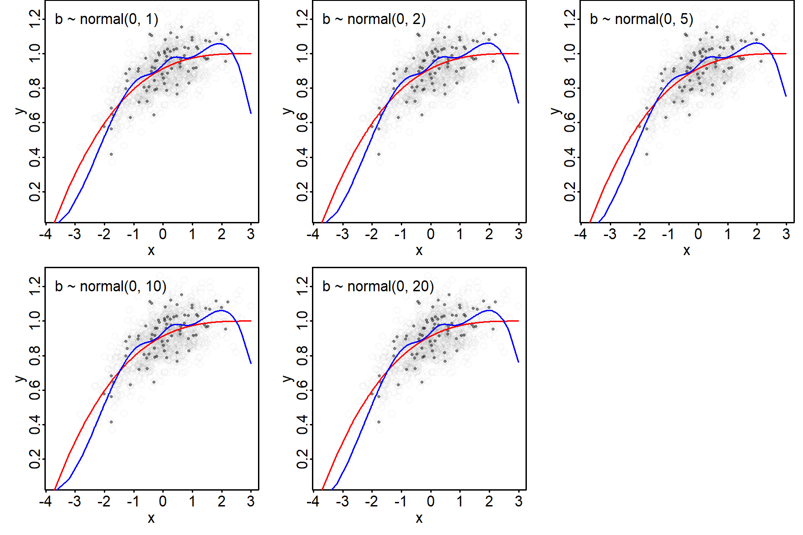
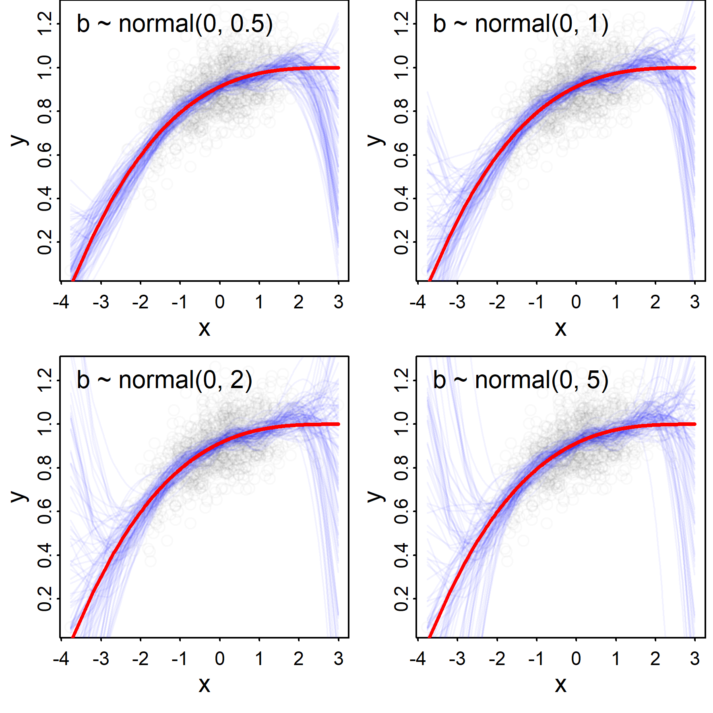
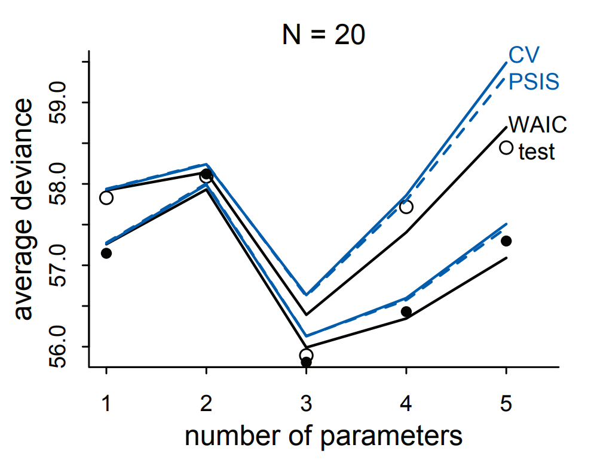
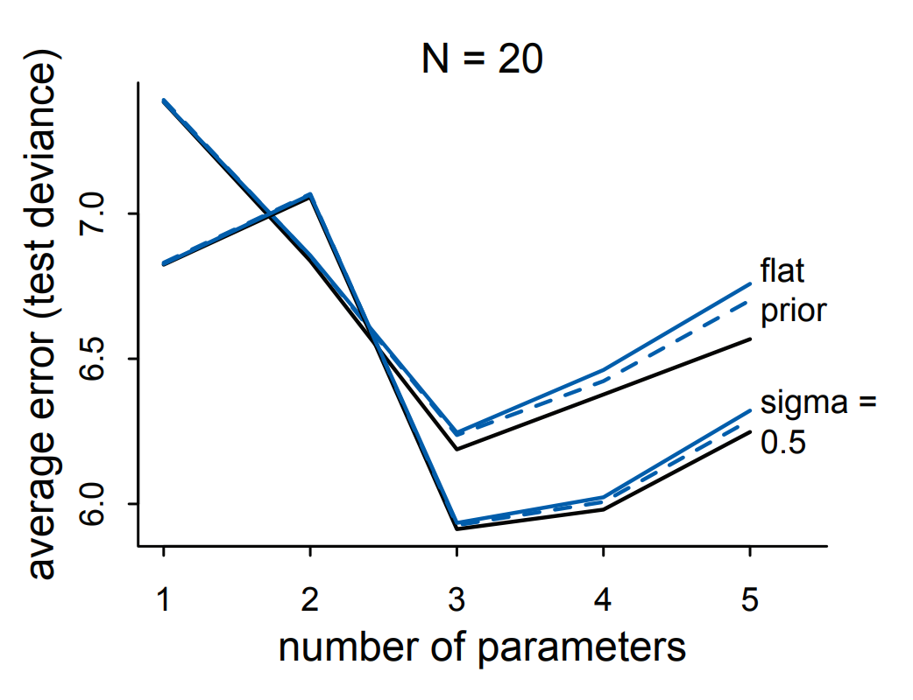

  

```{css, echo = F}
body{
  font-family: Helvetica;
  font-size: 16pt;
  max-width: 1000px;
  margin: auto;
  margin-left:310px;
}
pre{
  font-size: 20px;
}
/* Headers */
h1{
    font-size: 24pt;
  }
h1,h2{
    font-size: 20pt;
  }
h3,h4,h5,h6{
  font-size: 18pt;
}

#TOC {
  position: fixed;
  left: 0;
  top: 0;
  width: 300px;
  height: 100%;
  overflow:auto;
}

img {
    display: block;
    float: none;
    margin-left: auto;
    margin-right: auto;
}
```

```{css sidenote, echo = FALSE}
.sidenote, .marginnote { 
  float: right;
  clear: right;
  margin-right: -50%;
  width: 40%;         # best between 50% and 60%
  margin-top: 0;
  margin-bottom: 0;
  line-height: 2;
  font-size: 1.8rem;
  vertical-align: baseline;
  position: relative;
  }
```


```{r setup, include=FALSE, message=FALSE, warning=FALSE, results='hide'}
knitr::opts_chunk$set(echo = TRUE, dpi = 300, global.par = TRUE, fig.align = "center")

library(rethinking)
library(magrittr)
library(knitr)
library(kableExtra)
library(MASS)
source("../utils.R")
```

```{r, echo = F}
par(mar=c(3,3,0,1), mgp=c(1,.5,0), tck=-.01)
```

# Shrinkage

Model comparison (done correctly) helps to choose (or weight) models that provide a good representation of the true DGP by penalizing models that **overfit**. This penalization is achieved mainly by assessing "fit" not on a training data set, but on a hold out test data set.

A complementary approach to avoid overfitting is to shrink parameter estimates towards zero.
This can be achieved with penalized likelihood approaches (as done in the frequentist paradigm) or by using priors that favor small parameter values over large values. Shrinkage priors typically 

- have a mean of zero and 
- are normally distributed, with a
- _relatively_ small standard deviation. 

Here, _relative_ refers to the scale on which a predictor is measured.

## A visualization


To visualize how shrinkage works, we generate a small data set for which we want to estimate the mean:

```{r, fig.height=4, fig.width=4, out.width="50%"}
set.seed(5)
y = (rnorm(15) %>% scale()) + 1
par(mar=c(3,3,2,1), mgp=c(2,.7,0), tck=-.01)
hist(y)
```

We want a Bayesian estimate of the mean of `y`: $\small y \sim normal(mu, 1)$ with two different priors $\small mu \sim normal(0,\sigma_{wide})$ and $\small mu \sim normal(0,\sigma_{shrink})$ for mu:

```{r fig.height=4, fig.width=4, out.width="50%"}
par (mar=c(3,3,2,1), mgp=c(2,.7,0), tck=-.01)
curve(dnorm(x,0,1), -10, 10, n = 500,
      ylab = "density", xlab = "mu", col = "blue", lwd = 3)
curve(dnorm(x,0,3), n = 500, add = T,
      ylab = "density", xlab = "mu", col = adjustcolor("blue",alpha = .5), lwd = 3)
legend("topleft",
       lty = 1, lwd = 3,
       col = c("blue",adjustcolor("blue",alpha = .5)),
       legend = c("normal(0,1)","normal(0,3)"),
       bty = "n")
```

Here, we calculate the log-likelihood and the prior probability of different estimates for the mean of `y`

```{r class.source = "fold-show"}
mus = seq(-1,3,.01)
P = 
  apply(
    data.frame(mu = mus), 1, 
    function(mu)  {
      c(
        mu = mu,
        # P(data| mu)
        llikelihood = sum(dnorm(y,mean = mu, log = T)), 
        # P(mu), mu ~ normal(0,1)
        Psd1 = dnorm(mu,0, sd = 1, log = T),
         # P(mu), mu ~ normal(0,3)
        Psd3 = dnorm(mu,0, sd = 3, log = T)
      )
    }
  )
P[,1:5]
```

Next, we calculate the posterior probabilities:

```{r class.source = "fold-show"}
post1 = exp(P["llikelihood",] + P["Psd1.mu",])
post3 = exp(P["llikelihood",] + P["Psd3.mu",])
```

Now we can show likelihood, prior and posterior together:

```{r, fig.height=4, fig.height = 5}
par(mfrow = c(3,1), mar=c(2.75,2.75,0,.25), mgp=c(1.25,.1,0), tck=-.01)

curve(dnorm(x,0,1), min(mus), max(mus), n = 500,
      ylab = "P(mu)", xlab = "", col = "blue", lwd = 3)
curve(dnorm(x,0,3), n = 500, add = T,
      ylab = "density", xlab = "", col = adjustcolor("blue",alpha = .5), lwd = 3)
legend("topright",
       lty = 1, lwd = 3,
       col = c("blue",adjustcolor("blue",alpha = .5)),
       legend = c("mu ~ normal(0,1)","mu ~ normal(0,3)"),
       bty = "n")
mtext("Prior", line = -2, adj = .05)

plot(mus,exp(P["llikelihood",]),'l', xlab = "", ylab = "P(y|mu)", col = "red", lwd = 2)
mtext("Likelihood", line = -2, adj = .05)

plot(mus,post1,'l', xlab = "mu", ylab = "P(y|mu) * P(mu)", col = "purple", lwd = 2)
lines(mus,post3,'l', col = adjustcolor("purple",alpha = .5), lwd = 2)
abline(v = c(mus[which.max(post1)],mus[which.max(post3)]), lty = 3,
       col = c("purple",adjustcolor("purple",alpha = .5)))
legend("topright",
       lty = 1, lwd = 3,
       col = c("purple",adjustcolor("purple",alpha = .5)),
       legend = c("mu ~ normal(0,1)","mu ~ normal(0,3)"),
       bty = "n")
mtext("Posterior", line = -2, adj = .05)
```

Keep in mind that the posterior is the product of prior and likelihood (or the sum of log(prior) and log(likelihood)).

We zoom in to see more clearly how the narrow prior shrinks the estimated mu towards zero.

```{r  fig.height=4, fig.width=6, out.width="75%"}
par (mar=c(3,3,2,1), mgp=c(2,.7,0), tck=-.01)
ids = which(mus > 0 & mus < 1.5)
plot(mus[ids],post1[ids],'l', xlab = "mu", ylab = "P(y|mu) * P(mu)", col = "purple", lwd = 2)
lines(mus[ids],post3[ids],'l', col = adjustcolor("purple",alpha = .5), lwd = 2)
abline(v = c(mus[which.max(post1)],mus[which.max(post3)]), lty = 3,
       col = c("purple",adjustcolor("purple",alpha = .5)))
arrows(x0 = mus[which.max(post3)],
      x1 = mus[which.max(post1)],
      y0 = mean(c(max(post1),max(post3))),
      lwd = 1, length = .1)
legend("topleft",
       lty = 1, lwd = 3,
       col = c("purple",adjustcolor("purple",alpha = .5)),
       legend = c("mu ~ normal(0,1)","mu ~ normal(0,3)"),
       bty = "n")
```


## An example

To show that shrinkage works, we estimate spline models with different standard deviations on regression coefficients for the simulated income / well being data above.

```{r, fig.width=8, fig.height=6}
par(mfrow = c(2,1), mar=c(2.5,2.5,.5,1), mgp=c(1.75,.7,0), tck=-.01)
N = 1000
set.seed(123456)
x = sort(rnorm(N,mean = 0))
bf.s = splines::bs(x,df = 3)
bf.b = matrix(c(1,1,1),ncol = 1)
mu = bf.s %*% bf.b
y = rnorm(N, mu , sd = .1)
plot(x,y)
lines(x,mu, col = "red", lwd = 2)

matplot(x,bf.s,type = 'l', lty = 1)
```


Now we estimate the relationship with a more complex spline model with 8 basis functions. **The following animation shows the estimated relationships for different samples drawn from the population.**

{width=500px}


Hopefully you can see that large deviations between the true DGP in red and the estimated DGP in blue are less frequent when the prior on regression coefficients is narrow (top left) compared to when it is wider (bottom right).


To confirm this, the following plot shows deviances from a **cross-validation simulation** that 

- samples 1000 times 75 training and 75 test data points
- estimates model parameters on the training set
- calculates deviances for the training and test data sets.

The following figure shows deviances +/- 1 sd.

```{r, fig.height=4, fig.width=4, out.width="50%", echo=FALSE}
load("sim_lppd.Rdata")

plot_deviances = function() {
  D.test = -2*elpd.test
  D.train = -2*elpd.train
  m.test = colMeans(D.test)
  m.train = colMeans(D.train)
  
  within_sd = function(m) {
    apply(apply(m,2, function(x) x - rowMeans(m)), 2, sd)
  }

lower.test = m.test - within_sd(elpd.test)
upper.test = m.test +  within_sd(elpd.test)
lower.train = m.train - within_sd(elpd.train)
upper.train = m.train + within_sd(elpd.train)

par(mfrow = c(2,1), mar=c(.2,2.5,2,.5), mgp=c(1,.1,0), tck=-.01)
ylim = range(c(lower.train, upper.train))
xs = 1:ncol(elpd.test)
plot(xs, m.train, ylim = ylim, xaxt = "n",
     ylab = "Deviance", xlab = "", pch = 16)
arrows(xs,y0 = lower.train, y1 = upper.train, length = 0)
legend("topright", pch = c(16,16),
       bty = "n",
       col = c("black","blue"),
       legend = c("training data","test data"))

par(mar=c(2,2.5,.2,.5))
ylim = range(c(lower.test, upper.test))
plot(xs, m.test, col = "blue", pch = 16, ylim = ylim,
      ylab = "Deviance", xlab = "sd(b)", xaxt = "n")
arrows(xs,y0 = lower.test, y1 = upper.test, length = 0, col = "blue")
axis(1, at = 1:5, labels = b.sds)
}

plot_deviances()

```

Indeed, we see that while models with wider priors on the regression coefficients have a lower deviances in the training data, they have larger deviances for the test data. 

This becomes also clear, if we plot many estimated DGPs together. In the following figure, each blue lines show the expected `y` values inferred from 100 random samples and the red lines the true relationship between x an y.

```{r, echo = FALSE, results='hide'}
if(!file.exists("sim_shrinkage_spaghetti.png")) {
  library(splines)
  N = 1000
  set.seed(123456)
  x = sort(rnorm(N,mean = 0))
  bf.s = splines::bs(x,df = 3)
  bf.b = matrix(c(1,1,1),ncol = 1)
  mu = bf.s %*% bf.b
  y = rnorm(N, mu , sd = .1)
  load("sim_lppd.Rdata")
  png("sim_shrinkage_spaghetti.png", width = 10, height = 10, units = "cm", res = 450)
  par(mfrow = c(2,2), mar=c(2.5,2,0,.25), mgp=c(1,.1,0), tck=-.01)
  for (b.sd in b.sds[1:4]) {
    plot(x,y, col = adjustcolor("black", alpha = .025), cex.axis= .75)
    matlines(x,t(yhats[[which(b.sd == b.sds)]][1:100,]), lty = 1, 
             col = adjustcolor("blue",alpha = .05))
    text(-4,1.2, paste0("b ~ normal(0, ",round(b.sd,1),")"), pos = 4)
    lines(x,mu, col = "red", lwd = 2)
  }
  dev.off()
}

```

{width=500px}
<!-- Here is an example: Assume you want to estimate the effect of educational level (elementary school, high school, bachelor, master or more) and gender on income. -->

```{r, echo = FALSE, eval = FALSE}
X = expand.grid(edu = seq(-2,2,1), gender = c(0,1))
dt = do.call(rbind,lapply(1:4, function(x) X))
b = c(.75,.2,-.035,.1)
dt$y = model.matrix(~poly(edu,2,raw = T) + gender, dt) %*% b
ids = which(dt$edu == 2 & dt$gender == 1)
dt[ids[1],"y"] = dt[ids[1],"y"] + .75
dt = dt[-ids[3:4],]
dt$y = dt$y + rnorm(nrow(dt),0,.1)
plot(dt$edu,dt$y)
```

# Recap last week: From entropy to lppd

- Entropy ($\small  H(p)$) is a good measure of information:
<div class="marginnote"> 
- continuous
- increasing in $n$ 
- additive
</div>

$$
H(p) = \sum_{i=1}^{n} p_i log(p_i)
$$

- KL divergence ($\small D_{KL}$) measures the distance between two distributions $p$ and $q$

$$
D_{KL}(p,q) = \sum_i p_i \,log(p_i) - p_i \, log(q_i)
$$

- we do not need to know the true model to compare 2 hypothesized models, the deviance $\small log(q_i)$ is sufficient.

- deviance from the true model is calculated as the log pointwise predictive density ($\small lppd$), where $\small p(y|\Theta)$ is the likelihood

$$
\textrm{lppd}(y,\Theta) = \sum_i log \frac{1}{S}\sum_s p(y_i|\Theta_s)
$$

- To find a model that captures the DGP, we should employ **cross validation**, i.e. estimate a models lppd on a test--data set.


# Cross validation

**Cross validation is a general term that refers to a situation where model performance is estimated on a different data set than used for parameter estimation.**

So far, we have implemented a basic cross validation scheme manually, by simply **splitting** our total sample **in half**. However, data can also be split differently, e.g. 20% training data 80% test data or the other way around.

One popular way to split data to fit the data on $\small N-1$ data points and to use the $\small N^{th}$ data point as test data. This is referred to as _leave one out cross validation_ or LOO-CV. When dealing with likelihoods (and deviances) the LOO-CV is estimated by the **e**xpected **l**og **p**redictive **p**ointwise **d**ensity after **l**eaving **o**ut **o**ne data point, i.e. the $\textrm{elppd}_{\textrm{loo}}$

One easily implemented CV-scheme is LOO-CV: Calculating the deviance as the summed deviance over the $\small N$ LOO-CV deviances. for LOO-CV, there are always only N-1 training data sets.


$$
\textrm{elppd}_{\textrm{loo}} =  \sum_{i=1}^{n} \textrm{log } p(y_i|y_{-i})
$$

This is different for alternative schemes. For instance, at a samples size of 20, there are `r choose(20,10)` ways to construct the split-half training data set. Here, averaging over all possible test-data deviances would be too computationally expensive.

__One important thing to keep in mind when doing cross validation__ is that dependent observations (more specifically, observations with correlated errors) should always be kept in either test or training data sets. Such complications play e.g. a role in time series or hierarchically organized data sets. Cross validation also makes the assumption that the training data were generated by the same process as the test data. [though see here!](https://discourse.mc-stan.org/t/two-armed-bandit-hierarchical-reinforcement-learning-model-interpreting-conflicting-loo-and-posterior-predictive-check-results/33800/3)

## LOO-CV and PSIS-LOO

The computationally challenging part of LOO-CV is that one needs to estimate the model $\small N-1$ times.

Fortunately, one can **approximate LOO-CV** after fitting a model only once with _importance sampling_ (_IS-LOO_), which does not require refitting of models.
The key idea of importance sampling is to estimate out of sample deviance by giving different data points different weights $w_i$, such that unexpected data points have higher weights.

$$
w_i^{s} = \frac{1}{p(y_i|\theta^s)}
$$

**To recap: PSIS-LOO approximates the LOO-CV by calculating the the weighted average of the "likelihoods", where extreme likelihoods, i.e. unexpected data points, get larger weights.**

Importance sampling itself has weaknesses (extreme influence of extremely unexpected data points), which can be remedied by smoothing these weights. This is implemented in the _PSIS-LOO_ (pareto smoothed importance sampling) estimator of out of sample deviance. Here, not all $\small \textrm{lppd}$ receive the same weight when calculating the deviance, but 

- $\small \textrm{lppd}$ values of observations that have a strong influence receive a higher weight and 
- Pareto-smoothing (of the tails of the $\small \textrm{lppd}$ distribution) is used to get better / less extreme weights and to detect if the approximation is reliable at all. _If the approximation is unreliable (k-hat values above 0.7 or 1) this usually indicates problems with the model!_

# Information criteria

The goal of information criteria is to give us the same information that out of sample prediction (cross validation) gives us, without that we need to split the data into test and training set.

Information criteria are calculated from two quantities

- the deviance, which is just $\small D = -2 \cdot \textrm{lppd}$
- a penalty term

Well known information criteria, like $\textrm{AIC}$, and $\textrm{BIC}$ and maybe less well know  like $\textrm{DIC}$, $\textrm{WAIC}$ use the same deviance term, but different penalty terms:

<div class="marginnote"> 
$\textrm{DIC}$: If the deviance at the mean parameter is very different than the average deviance, this tells us that the model uses many different parameter values to achieve a good fit, and we remain uncertain which of these parameter values generalize to hold out data. Models with less certain generalization should be penalized.

$\textrm{WAIC}$:
If the log likelihood for a data point has a high variance, this is likely because different parameter values predict different data points well (the model trades off which data points to predict well). This also implies that we are uncertain, which parameter values would allow to predict hold out data, so that such model should be penalized.
</div>

- $\textrm{AIC}$: number of parameters ($2k$)
- $\textrm{BIC}$: number of parameters and sample size ($ln(n)k$)
- $\textrm{DIC}_{\textrm{Bayes}}$: average deviance minus the deviance at average $\small \theta$ ($\rightarrow$ "effective # parameters")
- $\textrm{WAIC}_{\textrm{Bayes}}$: variance of log likelihood over $\small \theta$ ($\rightarrow$ "effective # parameters")


Never heard of $\textrm{WAIC}$, why should you used it?

- has fewer requirements (about posterior distribution, relative weight of prior and likelihood, number parameters vs **sample size**)
- can provide warning signals if unreliable
- allows calculation of standard errors, which puts differences between models in perspective

## Are model comparison criteria any good?

The **benchmark is out of sample prediction or cross validation**, where we 

- draw first a training sample from the DGP, 
- estimate model parameters, 
- draw a test sample (of same size) from the DGP and 
- estimate the out of sample deviance as our parameter of interest.

In the following figure from the book, these **cross validation** values are represented by black dots for shrinkage priors and circles for flat priors.

Lines in the figures are _average values_ over 1000 simulations and show that on average information criteria, **(LOO)-CV**, **PSIS-LOO** and **WAIC** do a good job of approximating full cross validation. That is, they approcimate well the CV error/deviance.

{width=60%}

When looking at averages, positive and negative differences to full cross validation can cancel. Therefore, it is good to also look at the average absolute, i.e. for each simulated data set we calculate the absolute of the differences between cross validation lppd and the approximation. This is shown in the following figure:

{width=60%}    

Bottom line: **PSIS-LOO** and **WAIC** are relatively close to full cross validation and can be computed relatively cheaply. In practice, it is good to use both and take discrepant results are a warning signal.


# Model comparison

Information criteria are often used for model selection, but this is not the only way and should not even be the most important way to use the them.

More generally, we can think of two goals of model comparison:

- **Improving predictions**: Here, information criteria are most useful to determine weights for different models
- **Testing scientific hypotheses**: Here, we have specific qualitatively different scientific hypotheses that we express as statistical models so that we can select which model describes the data best (often done in cognitive psychology)

**Model comparison should not be used for covariate selection when we want to estimate causal effects**. When our interest is in causal effects, covariate selection should be determined based on the DAG^[Admittedly, things can get more complicated if we are uncertain about which DAG is correct. Model selection criteria can help to select or weight DAGs].


## When model selection leads astray

To illustrate why model comparison is not useful for covariate selection, we can go back to the example about the effect of treatment on well being: 

```{r fig.height=2.5, fig.width=6, fig.align = 'center'}
source("../Chapter6/dag_utils.R")
par(mfrow = c(1,2))
M_dag = dagitty(
  "dag{
  M->W;
  T->M;
  T->W
  }")
coord.list = 
  list(
    x=c(T=0,W=2,M=1),
    y=c(T=0,W=0,M=-1))
coordinates(M_dag) = coord.list
drawmydag(M_dag,cex = 2)

N = 150
set.seed(1)
T = rnorm(N)
M = T + rnorm(N)
W = 0.1*T + 0.5*M + rnorm(N)
grayblue = colorRampPalette(c("grey","blue"))
par(mar=c(2.5,2.5,.5,.5), mgp=c(1,.1,0), tck=-.01)
plot(W~T, col = grayblue(N)[rank(M)], pch = 16)
legend("topleft",pch = 16, col = c("gray","blue"), 
       legend = c("low M", "high M"), bty = "n")
```

Now we can estimate different models that use combinations of T and M to predict W.

```{r  class.source = "fold-show"}
dt = list(T = T, M = M, W = W)

# adjustment for treatment (incorrect model)
W.TM = quap(
  alist(
    W ~ dnorm(mu, sigma),
    mu <- a + bT*T + bM*M,
    a ~ dnorm(0,1),
    bT ~ dnorm(0,1),
    bM ~ dnorm(0,1),
    sigma ~ dexp(1)), 
  data = dt)

# no adjustment for treatment (correct model)
W.T = quap(
  alist(
    W ~ dnorm(mu, sigma),
    mu <- a + bT*T,
    a ~ dnorm(0,1),
    bT ~ dnorm(0,1),
    sigma ~ dexp(1)), 
  data = dt)

# effect of mediator (incorrect model)
W.M = quap(
  alist(
    W ~ dnorm(mu, sigma),
    mu <- a + bM*M,
    a ~ dnorm(0,1),
    bM ~ dnorm(0,1),
    sigma ~ dexp(1)), 
  data = dt)

# no effect (incorrect model)
W.a = quap(
  alist(
    W ~ dnorm(mu, sigma),
    mu <- a,
    a ~ dnorm(0,1),
    sigma ~ dexp(1)), 
  data = dt)
```

To see the WAIC for the model `W.TM` we use the `WAIC` function from the rethinking package. 

```{r class.source = "fold-show"}
WAIC(W.TM) %>% round(1)
```


To compare the models, we use the `compare` function:
```{r class.source = "fold-show"}
compare(W.TM, W.T, W.M, W.a) %>%  round(1)
```


```{r, echo = F}
cm = compare(W.TM, W.T, W.M, W.a)
```
Here is an explanation of the columns:

- WAIC: WAIC value for each model
- SE: Standard error of the WAIC (information criterion value to the left)
- dWAIC: WAIC difference between the best model and the row model 
- dSE: Standard error of the WAIC difference
- pWAIC: Penalty term (approximate number of effective parameters)
- weight: Model weight for an ensemble prediction.

We see that in a scenario where a good part of the treatment effect was mediated by motivation (the DPG is `M = T + rnorm(N)`, `W = 0.1*T + 0.5*M + rnorm(N)` ) the model we should use to estimate the treatment effect is not the best model, and even worse than a model that only uses the mediator.

One important benefit of WAIC (and PSIS-LOO) is that they come with standard error, so that we can compare differences in WAIC with our uncertainty of the difference. Looking at the two best models, we see that `W.M` is around `r round(cm["W.TM","dWAIC"],1)` WAIC better than `W.TM` and that the standard error of this difference is `r round(cm["W.TM","dSE"],1)`. Given that the WAIC difference is firmly within two times `dSE` we cannot conclude that the `W.M` model is certainly better than the `W.TM` model. In comparison, the `W.M` model is certainly better than the `W.T` model with a WIC differences of `r round(cm["W.T","dWAIC"],1)` and a standard error of `r round(cm["W.T","dSE"],1)`. 

This is more easily seen in a plot:

```{r}
plot(compare(W.TM, W.T, W.M, W.a))
legend("topright",
       pch = c(16,1,2),
       legend = c("sample deviance",
                  "WAIC +/- 2*SE",
                  "dWAIC +/- 2*dSE"),
       bty = "n")
```

What this plot also shows is that if we wanted to compare models `W.T` and `W.a` to decide if treatment was effective, the standard errors of the difference show us that we would not be very confident that the true model is better, even though the treatment effect is clearly different from zero:

```{r}
precis(W.T) %>% round(2)
```

One intuition for this is that if the data are relatively noisy, model comparison techniques will have difficulties to be sure if one model is clearly better than others, even if within one model the effect of treatment is clear. Model comparison techniques only care about out of sample predictions and penalize for additional parameters. If due to noisy data adding a causal variable does not improve prediction by much, this model will not clearly outperform simpler models.


## Functional form and robust regression

To correctly estimate effects it is not sufficient to choose the correct adjustment variables, but the functional form should also be (approximately?) correct.

Functional form refers to the form of the function that describes a relationship. The default for Gaussian regression models is a linear relationship, but we have seen that relationships can be non-linear.

Assume that we have collected the data in the following plot.

```{r fig.width=5, fig.height=4, out.width="60%"}
par (mar=c(3,3,0,1), mgp=c(2,.7,0), tck=-.01)
N = 500
set.seed(2)
x = sort(rnorm(N,mean = 0))
bf.s = splines::bs(x,df = 3)
bf.b = matrix(c(1,1,.8),ncol = 1)
mu = bf.s %*% bf.b
nn = 75
sidx = sample(N,nn)
y.n = rnorm(nn, mu[sidx] , sd = .1)
y = rstudent(nn, nu = 3, mu = mu[sidx], sigma = .1)
par(mfrow = c(1,1))
plot(x[sidx],y, xlab = "x", pch = 16)
#points(x[sidx],y.n, col = adjustcolor("black",alpha = .25))
#lines(x,mu, col = "red", lwd = 2)
x = x[sidx]
```

Now we want to know if the relationship between x and y is linear or non linear.

To do this, we fit a series of models of increasing complexity. To simplify, we set up a basic model and define design matrices for different models:

```{r}
quap.spline.model = 
  alist(
    y ~ dnorm(mu,sigma),
    mu <- X %*% b ,
    b ~ dnorm(0,1),
    sigma ~ dnorm(.25,.1)
  )

library(splines)
# linear regression
LM = model.matrix(~ 0 + x) %>% cbind(1)
# splines with different numbers of knots
B3 = bs(x, df = 3) %>% cbind(1)
B6 = bs(x, df = 6) %>% cbind(1)
B9 = bs(x, df = 9) %>% cbind(1)
```


Before we fit the models, lets look at prior predictions for `mu`:

```{r}
pp = function(X) {
  o = order(x)
  b = matrix(rnorm(ncol(X)*55, sd = 1),ncol = 55)
  yhat = X %*% b
  matplot(x[o],yhat[o,],type = 'l',
          col = adjustcolor("blue", alpha = .5), 
          lty = 1, xlab = "x", ylab = "x")
}

par(mfrow = c(2,2), mar=c(2.5,2.5,1,.5), mgp=c(1,.1,0), tck=-.01)
pp(LM); title("linear model")
pp(B3); title("splines with 3 knots")
pp(B6); title("splines with 6 knots")
pp(B9); title("splines with 9 knots")
```

With the basic model we have set up, we can now easily fit the linear regression and the spline models.

```{r}
q.B3 = 
  quap(quap.spline.model,
       data = list(X = B3, y = y, x = x),
       start = list(b=rep(0, ncol(B3)), sigma = .1))
q.B6 = 
  quap(quap.spline.model,
       data = list(X = B6, y = y, x = x),
       start = list(b=rep(0, ncol(B6)), sigma = .1))
q.B9 = 
  quap(quap.spline.model,
       data = list(X = B9, y = y, x = x),
       start = list(b=rep(0, ncol(B9)), sigma = .1))
q.LM = 
  quap(quap.spline.model,
       data = list(X = LM, y = y, x = x),
       start = list(b=rep(0, ncol(LM)), sigma = .1))

# work around a bug
attr(q.B3,"nobs") = 50
attr(q.B6,"nobs") = 50
attr(q.B9,"nobs") = 50
attr(q.LM,"nobs") = 50
```

And we plot the model predictions: 

```{r, fig.width=8, fig.height=4}
par(mfrow = c(1,1), mar=c(3,3,.5,.5), mgp=c(1.25,.1,0), tck=-.01)
plot_preds = function(q.fit, add = FALSE, col = "blue") {
  mu.mat = link(q.fit,n = 1e4)
  if(is.list(mu.mat)) mu.mat = mu.mat[["mu"]]
  mu = apply(mu.mat,2,mean)
  mu.ci = apply(mu.mat,2,function(x) quantile(x,c(.05,.95)))
  x = q.fit@data[["x"]]
  o = order(x)
  if (add == FALSE) {
    plot(x,y, ylim = range(mu.ci))
  }
  lines(x[o],mu[o],'l', col = col)
  shade(mu.ci[,o],x[o], col = adjustcolor(col,alpha = .25))
}

plot(x,y, ylim = c(0,1.35), pch = 16)
plot_preds(q.LM, add = TRUE, "orange")
plot_preds(q.B3, add = TRUE, "blue")
plot_preds(q.B6, add = TRUE, "purple")
plot_preds(q.B9, add = TRUE, "violet")

legend("topleft",
       fill = c("orange","blue","purple","violet"),
       legend = c("linear model", paste(c(3,6,9),"knots")),
       bty = "n")
```

More flexible models fit the data better, as long as they are not too flexible. This can be seen if we use `compare` with `WAIC`:

```{r class.source = "fold-show"}
compare(q.B3,q.B6,q.B9,q.LM, func = "WAIC") %>% round(2)
```

Now we use `PSIS-LOO` to compare the models:

```{r class.source = "fold-show"}
compare(q.B3,q.B6,q.B9,q.LM, func = "PSIS", n = 1e5) %>% round(2)
```

These warnings tells us that there are some very influential data points that determine to a large degree the PSIS-LOO values. Even if we are tempted to compare models now, there is really no point because we can't trust the PSIS-LOO values.

To improve the situation, we investigate which points are influential. To do this, we can use `PSIS` with the flag `pointwise == TRUE` to get the parameter `k` for each data point. "k" is the shape parameter of the Pareto distribution, and values larger .7 / 1 indicate problems.

```{r}
plot_influencial = function(q.fit, ylim = NULL, xlim = NULL) {
  plot(x,y, pch = 16, ylim = ylim, xlim = xlim)
  plot_preds(q.fit, add = TRUE, "blue")
  PSISLOO = PSIS(q.fit, pointwise = TRUE,n = 5e4)
  points(x[which(PSISLOO$k > .5)],y[which(PSISLOO$k > .5)], pch = 16, col = "orange")
  points(x[which(PSISLOO$k > 1)],y[which(PSISLOO$k > 1)], pch = 16, col = "red")
  text(2,.2, paste("sigma = ",round(coef(q.fit)["sigma"],3)), pos = 2)
  legend("topleft", pch = 16,
         col = c("orange","red"),
         legend = c("k > .5", "k > 1"), bty = "n")
}

par(mfrow = c(2,2),  mar=c(3,3,1,.5), mgp=c(1.25,.1,0), tck=-.01)
plot_influencial(q.LM); title("linear model")
plot_influencial(q.B3); title("splines, 3 nodes")
plot_influencial(q.B6); title("splines, 6 nodes")
plot_influencial(q.B9); title("splines, 9 nodes")
```

Note that more complex models have a higher number of influential data points. The intuition here is that the flexibility of `mu`allows the error variance to be smaller. The price one pays is that data points that are far away from `mu` become very influential because the density (of the normal error distribution) falls off quickly.

The PSIS warnings are another instance of the _folk theorem of statistical modelling_ which states that modeling and estimation problems are often a result of mis-specified statistical models.

The figure makes clear that all models do a bad job dealing with outliers. One method to deal with outliers and that comes under the name "robust regression" uses the student t distribution as an error model (instead of the normal distribution):

```{r, fig.width=4.5, fig.height=4, out.width="60%"}
par (mar=c(3,3,0,1), mgp=c(2,.7,0), tck=-.01)
curve(dnorm(x, mean = , sd = 1), -4, 4, n = 50, ylab = "density", lty = 3)
curve(dstudent(x, nu = 2, mu = 0, sigma = 1), -4, 4, n = 500,  add = TRUE)
legend("topleft", lty = c(1,3), cex = .9,
       legend = c("dstudent(0,2,1)","dnorm(0,1)"),
       bty = "n")
```

Because the density of the student t distribution is lower close to zero and higher longer away from zero, observed values that are far away from `mu` will have a larger likelihood and will this be less influential.

The next figure shows that, by using a student-t error distribution, we can increase the likelihood of values far away from `mu`, decrease the likelihood of values close to `mu` and thus reduce the relative importance of the outlier values.


<div class="marginnote"> 
The bottom left point can be influential because the mu values there are more variable (see the wider CI).
</div>


```{r warning = F, message=FALSE}
par(mfrow = c(1,1), mar=c(3,3,.5,.5), mgp=c(1.25,.1,0), tck=-.01)
plot_influencial(q.B6, xlim = c(min(q.B6@data$x),2.5), ylim = c(-.2,1.5))
yhat = colMeans(link(q.B6,n = 1e4))
sigma = coef(q.B6)["sigma"]
PSISLOO = PSIS(q.B6, pointwise = TRUE, n = 5e4)
xs = seq(-1,1,.01)
d = dnorm(xs,0,sigma)/4
ds = dstudent(xs,0,nu = 2, sigma)/4

for (j in which(PSISLOO$k > .5)) {
  lines(d+x[j],xs+yhat[j], lty = 3)
  lines(ds+x[j],xs+yhat[j])
  lines(x = rep(x[j],2), y = c(min(xs), max(xs))+yhat[j], col = "grey")
}
```


Under the student-t error distribution influential data points that are far away from `mu` have a higher density compared to under the Gaussian model.

Now lets re-estimate the data with a student-t error distribution. Here is the basic model.

```{r class.source = "fold-show"}
quap.spline.model = 
  alist(
    y ~ dstudent(3, mu, sigma), # student-t errors
    mu <- X %*% b ,
    b ~ dnorm(0,1),
    sigma ~ dnorm(.25,.1)
  )
```

```{r}
q.B3r = 
  quap(quap.spline.model,
       data = list(X = B3, y = y, x = x),
       start = list(b=rep(0, ncol(B3)), sigma = .1))
q.B6r = 
  quap(quap.spline.model,
       data = list(X = B6, y = y, x = x),
       start = list(b=rep(0, ncol(B6)), sigma = .1))
q.B9r = 
  quap(quap.spline.model,
       data = list(X = B9, y = y, x = x),
       start = list(b=rep(0, ncol(B9)), sigma = .1))
q.LMr = 
  quap(quap.spline.model,
       data = list(X = LM, y = y, x = x),
       start = list(b=rep(0, ncol(LM)), sigma = .1))

# work around a bug
attr(q.B3r,"nobs") = 50
attr(q.B6r,"nobs") = 50
attr(q.B9r,"nobs") = 50
attr(q.LMr,"nobs") = 50
```


And we compare the models again.

```{r}
compare(q.B3r,q.B6r,q.B9r,q.LMr, func = "PSIS", n = 25e3) %>% round(2)
```

This time there are no warnings and we can relatively safely conclude that the spline models describe a the relationship between y and x best.

Here are the new models' predictions:

```{r}
par(mfrow = c(1,1), mar=c(3,3,.5,.5), mgp=c(1.25,.1,0), tck=-.01)
plot(x,y, ylim = c(0,1.35), pch = 16)
plot_preds(q.LMr, add = TRUE, "orange")
plot_preds(q.B3r, add = TRUE, "blue")
plot_preds(q.B6r, add = TRUE, "purple")
plot_preds(q.B9r, add = TRUE, "violet")

legend("topleft",
       fill = c("orange","blue","purple","violet"),
       legend = c("linear model", paste(c(3,6,9),"knots")),
       bty = "n")
```


# Questions:

## M1

see Page 222.

$$
\textrm{lppd}(y,\Theta) = \sum_i log \frac{1}{S}\sum_s p(y_i|\Theta_s)
$$
$$
\textrm{penalty}_\textrm{WAIC} =  \sum_i var_\theta \;log \;p(y_i|\theta)
$$


$$
\textrm{WAIC}(y,\Theta) = -2 \left(lppd - \textrm{penalty}_\textrm{WAIC} \right)
$$
$$
\textrm{AIC}(y,\Theta) = -2lppd + 2k
$$

where $p$ is the number of free parameters in a model.

AIC and WAIC penalize for model complexity, but use different ways to estimate complexity:

- \textrm{AIC}: Number of parameters times 2
- \textrm{AIC}: Variation of likelihood dependent on model parameters $\Theta_s$. $\Theta_s$ is a set of model parameters (one sample from the multi-parameter-posterior) and the variation is calculated as the variation over samples.  
- The AIC needs only a point estimate, the WAIC needs a posterior distribution.

The AIC is easier to calculate, but requires more assumptions (likelihood overwhelms prior and posterior is a multivariate normal).

## M3

The components of fit indices depend on the data, especially the lppd and aspects of the model, like e.g. number of parameters. If we change the data in addition to aspects of the model, we can no longer be sure that the difference between fit values is due to the model, and not dur to the data.

## M6

To illustrate, lets fit these data with a narrow prior and a wider prior.

```{r, echo = F}
set.seed(5)
y = (rnorm(15) %>% scale()) + 1
hist(y)
```

```{r fig.height=6, fig.width=4, echo = F, out.width="75%"}
mus = seq(-3,3,.01)
P = 
  apply(
    data.frame(mu = mus), 1, 
    function(mu)  {
      c(
        mu = mu,
        # P(data| mu)
        llikelihood = sum(dnorm(y,mean = mu, log = TRUE)), 
        # P(mu), mu ~ normal(0,1)
        Psd1 = dnorm(mu,0, sd = 1, log = TRUE),
         # P(mu), mu ~ normal(0,3)
        Psd0.2 = dnorm(mu,0, sd = .2, log = TRUE)
      )
    }
  )

post1 = exp(P["llikelihood",] + P["Psd1.mu",])
post0.2 = exp(P["llikelihood",] + P["Psd0.2.mu",])
post1 = post1/sum(post1)
post0.2 = post0.2/sum(post0.2)

par(mfrow = c(3,1), mar=c(2.75,2.75,0.1,.25), mgp=c(1.25,.1,0), tck=-.01)

curve(dnorm(x,0,.2), min(mus), max(mus), n = 500,
      ylab = "P(mu)", xlab = "", col = adjustcolor("blue",alpha = .5), lwd = 3)
curve(dnorm(x,0,1), n = 500, add = TRUE,
      ylab = "density", xlab = "", col = "blue", lwd = 3)
legend("topright",
       lty = 1, lwd = 3,
       col = c("blue",adjustcolor("blue",alpha = .5)),
       legend = c("mu ~ normal(0,1)","mu ~ normal(0,.2)"),
       bty = "n")
mtext("Prior", line = -2, adj = .05)

plot(mus,exp(P["llikelihood",]),'l', xlab = "", ylab = "P(y|mu)", col = "red", lwd = 2)
mtext("Likelihood", line = -2, adj = .05)

plot(mus,post0.2,'l', xlab = "mu", ylab = "P(y|mu) * P(mu) [normalized]", col = adjustcolor("purple",alpha = .5), lwd = 2)
lines(mus,post1,'l', col = "purple", lwd = 2)
abline(v = c(mus[which.max(post1)],mus[which.max(post0.2)]), lty = 3,
       col = c("purple",adjustcolor("purple",alpha = .5)))
legend("topright",
       lty = 1, lwd = 3,
       col = c("purple",adjustcolor("purple",alpha = .5)),
       legend = c("mu ~ normal(0,1)","mu ~ normal(0,0.2)"),
       bty = "n")
mtext("Posterior", line = -2, adj = .05)
```

At mu values with a higher density the prior with the small standard deviation is close to zero, and the posterior is dominated by the prior (multiplying the prior with a number close to zero results in posterior close to zero.)

Conversely, the prior density of the narrow prior is so large, that we are still see a (weak) signal of the prior at mu values that are close to zero.

In sum, a very narrow prior overwhelms information in a small data set.

