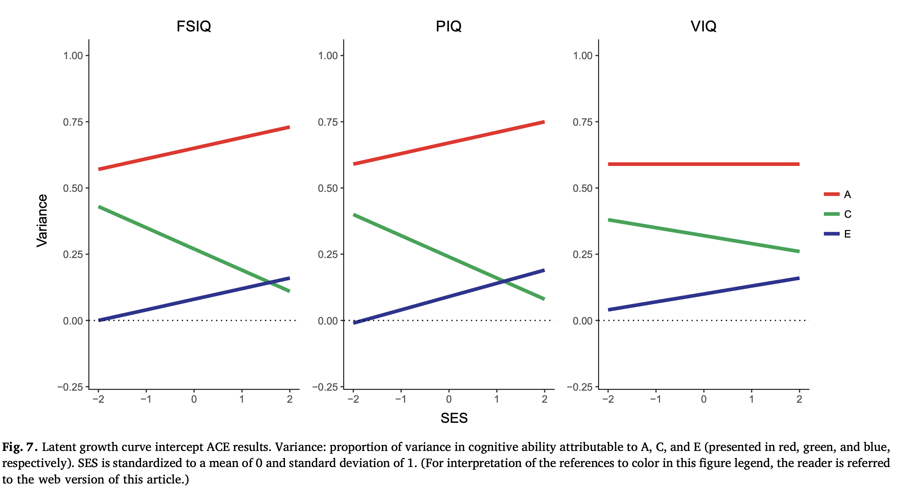

  
```{css, echo = F}
body{
  font-family: Helvetica;
  font-size: 16pt;
}
pre{
  font-size: 20px;
}
/* Headers */
h1{
    font-size: 24pt;
  }
h1,h2{
    font-size: 20pt;
  }
h3,h4,h5,h6{
  font-size: 18pt;
}
```

```{r setup, include=FALSE, message=FALSE, warning=FALSE, results='hide'}
knitr::opts_chunk$set(echo = TRUE, dpi = 300, global.par = TRUE)

library(rethinking)
library(magrittr)
library(knitr)
library(kableExtra)
library(MASS)
source("../utils.R")
```

# The Scarr-Rowe effect

We are going to use the [Scarr-Rowe effect](https://en.wikipedia.org/wiki/Scarr%E2%80%93Rowe_effect) (or hypothesis) to look more closely on interaction effects. The Scarr-Rowe hypothesis states that the (genetic) **heritability of a trait depends on the environment**, such that the effects of genes are larger when environments are better. The underlying idea is that if everyone lives in a perfect environment, i.e. there is no variation in the relevant environment, then a trait will only depend on genes.

This interaction can be visualized as follows:

```{r fig.height=4, fig.width=4, fig.align = 'center', out.width="40%"}
par(mar=c(3,3,.5,.5), mgp=c(1.75,.5,0), tck=-.01)
heritability = c(scarce = 0.5, plentiful = 0.8)
barplot(heritability,
        ylim = c(0,1),
        xlab = "environment",
        ylab = "heritability (effect of genes)")
```


Here is a DAG that describes such a model, where

- $\small A$ = additive genetic effects on child IQ
- $\small SES$ = parental socioeconomic status
- $\small IQ$ = child's intelligence quotient

and the Scarr-Rowe effect means the the coefficient of the path $\small A \rightarrow IQ$ depends on $\small SES$.

```{r fig.height=3, fig.width=3, fig.align = 'center', out.width="40%"}
library(dagitty) 
dag = dagitty(
  "dag{
  IQ;
  A -> IQ;
  SES -> IQ;
  }")
coord.list = 
  list(
    x=c(A=0,SES=0,IQ=1),
    y=c(A=-.5,SES=.5,IQ=0))
coordinates(dag) = coord.list
drawdag(dag, cex = 1.5)
```


**Note that DAGs do not encode interaction effects by drawing an arrow from the moderator to the relevant path.** Instead, there is a path from the moderator to the outcome variable. So the DAG only tells us that IQ is a function of four other variables $\small IQ = f(A,SES)$, but it does not tell us what the function $f()$ is. 

This function could be 

- $\small IQ = A + SES$, 
- $\small IQ = A \cdot SES$ or 
- $\small IQ = SES + A \cdot SES$,
- ...

or any other imaginable function that uses the variables. The model we have in mind now is:

$$
IQ =  f(SES) A
$$

Lets simulate data that show the the Scarr-Rowe effect, first our exogenous variables. To keep things simple, we assume that all variables are normally distributed:

```{r class.source = 'fold-show'}
set.seed(3)
N = 250
SES = rnorm(N,mean = 5,1)
A = rnorm(N,mean = 10,2)
SES = rlnorm(N,log(4.75),.3)
A = rlnorm(N,log(10),.2)
```

Now comes the interesting part: Scarr-Rowe assumes that the effect or weight of genes depends on the SES. So we formulate the weight of genes as as a function of SES. For good measure, we also let the effect of the familial environment vary by SES.

```{r class.source = 'fold-show', warning=FALSE, message=FALSE}
library(boot)
# use inv.logit to give weights a lower and upper bound
# add a constant one to model that even at lowest SES 
# there are genetic effects
b_A = function(x) 0.5 + inv.logit(x-5) * 2.5
```


We are literally defining the weight for A as a function of SES. This is one way to understand interactions. Here is a visualization of the weights, with a histogram of SES values on the bottom.

```{r fig.height=4, fig.width=5, fig.align = 'center', out.width="70%"}
par(mar=c(3,3,.5,.5), mgp=c(1.75,.5,0), tck=-.01)
curve(b_A(x),0,10, 
      ylab = expression("effect size"~beta[A]), 
      ylim = c(0,b_A(10)), xlab = "SES")
hist(SES,add = T, probability = T)
```
**In this plot, the interaction is encoded by the fact that $\small \beta_A$ has a slope.**

Now we can simulate IQ values using exogenous variables and derived weights. We assume that IQ depends on $\small A$, whereby this effect depends on $\small SES$: $\small IQ = f(SES)A$. Lets simulate data from this model:

```{r class.source = 'fold-show', fig.height=4, fig.width=4, fig.align = 'center', out.width="50%"}
# Adding 70 to get an IQ around 100
IQ = 85 + b_A(SES)*A + rnorm(N,sd = 10)
par(mar=c(3,3,.5,.5), mgp=c(1.75,.5,0), tck=-.01)
hist(IQ)
```

If we just look at the bivariate associations between  $\small A$ or $\small SES$ and $\small IQ$, we get the following plot:

```{r fig.height=4, fig.width=8, fig.align = 'center', out.width="100%"}
par(mfrow = c(1,2),mar=c(3,3,1,.5), mgp=c(1.75,.5,0), tck=-.01)
plot(SES,IQ, pch = 16, cex = .5,)
plot(A,IQ, pch = 16, cex = .5,)
```

# Categorial interactions

To run a simple interaction with a categorical interaction variable we dichotomise the SES variable to create the variable `SES.c`:

```{r class.source = 'fold-show'}
low.SES = which(SES < quantile(SES,.50))
high.SES = which(SES > quantile(SES,.50))
idx = c(low.SES,high.SES)
dt = data.frame(
  A = A[idx],
  IQ = IQ[idx],
  SES = SES[idx],
  SES.c = c(rep(1,length(low.SES)),
            rep(2,length(high.SES))))
```


Lets plot the association between  $\small A$ and $\small IQ$ again, this time split by SES:

```{r fig.height=4, fig.width=4, fig.align = 'center', out.width="50%"}
low.SES = dt$SES.c == 1
high.SES = dt$SES.c == 2
plot_data = function(dt) {
  par(mar=c(3,3,1,.5), mgp=c(1.75,.5,0), tck=-.01)
  plot(IQ ~ A, data = dt, col = dt$SES.c, pch = 16, cex = .5,
       ylim = range(dt$IQ), ylab = "IQ", xlab = "A")
  legend("topleft", pch = 16, col = c("black","red"),
         legend = c("low SES","high SES"), bty = "n")
  
}
plot_data(dt)
#abline(lm(IQ ~ A, data = dt[low.SES,]), col = "black")
#abline(lm(IQ ~ A, data = dt[high.SES,]), col = "red")
```

Next, we estimate some linear regression models with increasing complexity, our goal being to have a model that accurately depicts the effect of A, C, E, and SES on the IQ.

## Simple linear regression

We start with a simple linear regression. But first some intuitions on priors:

- Eyeballing the data, we see that the IQ at an average $\small A$ of 10 is around 100, so we use a prior `a ~ dnorm(100,5)`
- The range of $\small A$ is 16-6 = 10 and the range of IQ = 120-80 = 40. So for a one unit increase of $\small A$, IQ changes around 40/10 = 4. If we want that an effect of +/-4 is at 1 sd of the prior, we set the prior for the effect of $\small A$ to `a ~ dnorm(0,4)`. This prior allows for the possibility of a negative effect of $\small A$. 
- Lacking a strong intuition for the error variance, we set the prior for the variance to a generous `dexp(0.25)` 

Here is the regression model:

```{r class.source = 'fold-show'}
IQ.A = 
  quap(
    alist(
      IQ ~ dnorm(mu,sigma),
      mu <- a + b*(A - 10),
      a ~ dnorm(100,5),
      b ~ dnorm(0,4),
      sigma ~ dexp(.5)
    ),
    data=dt)
```

Lets quickly look at the prior predictions to make sure the piors are OK.

```{r class.source = 'fold-show', fig.height=4, fig.width=4, fig.align = 'center', out.width="50%"}
prior = extract.prior(IQ.A)
A.seq = seq(from=0,to=20,length.out=50)
mu = link(
  IQ.A,
  post=prior,
  data=data.frame(A=A.seq))

par(mar=c(3,3,1,.5), mgp=c(1.75,.5,0), tck=-.01)
plot(
  0,type = "n", ylab = "IQ", xlab = "A", 
  xlim = c(min(A),max(A)),
  ylim = c(70,130))
matlines(
  A.seq,t(mu[1:100,]),type = "l", lty = 1,
  col = adjustcolor("blue", alpha = .5))
```

Yes, this looks good.

Here are the posterior predictions:

```{r fig.height=4, fig.width=4, fig.align = 'center', out.width="50%"}
plot_data(dt)
plot_mu.CIs(IQ.A, data.frame(A=A.seq), "blue", spaghetti = TRUE)
```

This looks generally fine, but we are not capturing the group effects.

## Linear regression with category-main effect

To fit a model with a main effect of education, we use the indexing approach:

```{r class.source = 'fold-show'}
set.seed(1)
IQ.A_SES = 
  quap(
    alist(
      IQ ~ dnorm(mu,sigma),
      mu <- a[SES.c] + b*(A - 10),
      a[SES.c] ~ dnorm(100,5),
      b ~ dnorm(0,4),
      sigma ~ dexp(.5)
    ),
    data=dt)
```


```{r fig.height=4, fig.width=4, fig.align = 'center', out.width="50%"}
plot_data(dt)
plot_mu.CIs(IQ.A_SES, data.frame(A=A.seq, SES.c = 1), "black")
plot_mu.CIs(IQ.A_SES, data.frame(A=A.seq, SES.c = 2), "red")
```

We can see already from the plot the the model with separate means for high and low SES is better. But here is the comparison with PSIS-LOO:

```{r}
compare(
  IQ.A,IQ.A_SES,
  func = "PSIS") %>% 
  round(2)
```


## Linear regression with category-main effect and category-slope

Lastly, we can also let the slopes vary by SES: 

```{r class.source = 'fold-show'}
IQ.AxSES = 
  quap(
    alist(
      IQ ~ dnorm(mu,sigma),
      mu <- a[SES.c] + b[SES.c]*(A - 10),
      a[SES.c] ~ dnorm(100,5),
      b[SES.c] ~ dnorm(0,2),
      sigma ~ dexp(.5)
    ),
    data=dt)
```

The key part of this model is that we are not specifying a main effect for A and an interaction effect with SES, but that we are **estimating 2 regression coefficients, one for high and one for low SES. This simplifies putting reasonable priors on the effect in each group, but also implies that we do not put a prior on the difference between the two groups.**


And again the posterior predictions: 

```{r fig.height=4, fig.width=4, fig.align = 'center', out.width="50%"}
par(mar=c(3,3,2,.5), mgp=c(1.75,.5,0), tck=-.01)
plot_data(dt)
plot_mu.CIs(IQ.AxSES, data.frame(A=A.seq, SES.c = 1), "black")
plot_mu.CIs(IQ.AxSES, data.frame(A=A.seq, SES.c = 2), "red")
```

Even though the DGP does not have different "intercepts" for high and log SES, we have to add it, because our model puts the intercept at A = 10, whereas it was A = 0 in the DGP.

Here is a comparison of all the models we have fit:

```{r class.source = 'fold-show'}
compare(
  IQ.A, IQ.A_SES, IQ.AxSES,
  func = "PSIS") %>% 
  round(2)
```
```{r class.source = 'fold-show'}
compare(
  IQ.A, IQ.A_SES, IQ.AxSES,
  func = "WAIC") %>% 
  round(2)
```

While the correct model has the best PSIS and WAIC value, for the top two models the differences are not large compared to the SEs of the differences.

### A simple contrast

How can we figure out if the difference in slopes is reliably larger than 0? We simply extract posteriors and calculate the difference in slopes from them:


```{r class.source = 'fold-show'}
# extract posterior
post = extract.samples(IQ.AxSES)
names(post)
head(post$b)
```

We simply calculate the differences of the two b parameters:

```{r class.source = 'fold-show'}
delta.b = post$b[,2]-post$b[,1]
```

And now we can show e.g. mean and PIs:

```{r class.source = 'fold-show'}
c(mean = mean(delta.b),
  PI(delta.b,prob = c(.9))) %>% 
  round(2)
```

And we can plot a histogram of the contrast:

```{r fig.height=3, fig.width=4, fig.align = 'center', out.width="40%"}
par(mar=c(3,3,2,1), mgp=c(1.25,.5,0), tck=-.01)
hist(delta.b, xlim = range(c(0,delta.b)))
abline(v = 0, lty = 2)
abline(v = PI(delta.b,prob = c(.95)), col = "red")
```

### How about the DGP?

To see if our results are reasonable, lets compare our estimated parameters with the parameters governing the DGP. First the model parameters: 

```{r class.source = 'fold-show'}
precis(IQ.AxSES, depth = 2) %>% round(2)
```

Now the parameters from the DGP:

```{r class.source = 'fold-show'}
rbind(
  mean(b_A(SES[SES<quantile(SES,.30)])), 
  mean(b_A(SES[SES>quantile(SES,.70)])))
```

We are not recovering the exact parameters, after all we used a _golem_ instead of a model that depicts the DGP, but qualitatively the results are consistent with the DGP.

## Symetric interactions

Earlier, we described the function

$$
IQ =  f(SES) A
$$

By saying that the effect $\small A$ is a function of $\small SES$. However, we really just have two variables: $\small A$ and $\small f(SES)$ which are multiplied with each other. Therefore, these statements are equivalent:

- The effect of $\small A$ depends on $\small f(SES)$
- The effect of $\small f(SES)$ depends on $\small A$

Accordingly, we can also plot the difference between high and low $\small SES$ as a function of $\small A$:

```{r fig.height=4, fig.width=4, fig.align = 'center', out.width="50%"}
A.seq = seq(from=5,to=16,length.out=50)
mu.low = link(IQ.AxSES,data=data.frame(SES.c=1,A=A.seq))
mu.high = link(IQ.AxSES,data=data.frame(SES.c=2,A=A.seq))
delta = mu.high-mu.low
CIs = apply(delta,2,PI)
par(mar=c(3,3,2,.5), mgp=c(1.75,.5,0), tck=-.01)
plot(A.seq, colMeans(delta),'l',
     ylim = range(CIs),
     col = "blue",
     xlab = "A",
     ylab = expression(IQ[high~SES]~-~IQ[low~SES]))
shade(CIs,A.seq, col = adjustcolor("blue", alpha = .25))
abline(h = 0, lty = 2)
```

# Continuous interactions

We are continuing with our simulated Scarr-Rowe data set, but this time we use the full data and formulate a continuous interaction.

```{r}
dt = data.frame(
  A = A,
  IQ = IQ,
  SES = SES)
```

## Plotting the data

You can try it the fancy way and make a 3d plot, but in this instance its a lot of effort for meager results:

```{r fig.height=6, fig.width=6, fig.align = 'center', out.width="100%"}
library(plot3D)
points3D(A,SES,IQ, type = "h",
         col = "black",
         cex = .75,
         lty = 3,
         pch = 16,
         phi = 20,
         theta = 45,
         xlab = "A",
         ylab = "SES",
         zlab = "IQ")
```

A panel of 2d plots does the job better, and will later allow to display uncertainty.

```{r fig.height=3, fig.width=10, fig.align = 'center', out.width="120%"}
qs = quantile(SES, probs = seq(0,1,.25))
par(mfrow = c(1,4), mar=c(2.5,2.5,2,.5), mgp=c(1.5,.5,0), tck=-.01)
for (k in 2:length(qs)) {
  idx = which(dt$SES > qs[k-1] & dt$SES < qs[k])
  tmp.dt = dt[idx,]
  with(tmp.dt,
       plot(IQ~A, pch = 16, main = paste0(k-1,". quantile SES"),
       ylim = range(dt$IQ), xlim = range(dt$A)))
}
  
```
How many panels one uses depends on how one assumes the moderator influences the effect of interest.

## Simple linear regression without interaction

This first model assumes that there are just main effects of $\small A$ and $\small SES$. Indeed, this is not an unreasonable assumption if one remembers the raw data, which we show here again:

```{r fig.height=4, fig.width=8, fig.align = 'center', out.width="60%", out.height="50%"}
par(mfrow = c(1,2),mar=c(3,3,1,.5), mgp=c(1.75,.5,0), tck=-.01)
plot(SES,IQ, pch = 16, cex = .5,)
plot(A,IQ, pch = 16, cex = .5,)
```


In preparation for the interaction model we are not centering $\small SES$, but we are re-scaling it to have a minimum just above 0. If we would center to zero, below zero SES values would predict a negative additive genetic effect.

The simple linear model can be descried as follows (omitting indicators $_i$ for individuals):

$$
\mu = \alpha + \beta_{A}A + \beta_{S}SES
$$

```{r class.source = 'fold-show'}
IQc.A_SES = 
  quap(
    alist(
      IQ ~ dnorm(mu,sigma),
      mu <- a + ba*(A - 10) + bs*(SES - 2.5),
      a ~ dnorm(100,10),
      ba ~ dnorm(0,4),
      bs ~ dnorm(0,4),
      sigma ~ dexp(.5)
    ),
    data=dt)
```

We are using prior predictions to check if the model does a good job:

```{r fig.height=3, fig.width=10, fig.align = 'center', out.width="120%"}
plot.pred(IQc.A_SES,dt, type = "prior")
```

This is pretty wild. Lets try a bit narrower priors:

```{r class.source = 'fold-show', fig.height=3, fig.width=10, fig.align = 'center', out.width="120%"}
set.seed(1)
IQc.A_SES = 
  quap(
    alist(
      IQ ~ dnorm(mu,sigma),
      mu <- a + ba*(A - 10) + bs*(SES - 2.5),
      a ~ dnorm(100,7.5),
      ba ~ dnorm(0,2),
      bs ~ dnorm(0,2),
      sigma ~ dexp(.5)
    ),
    data=dt)
plot.pred(IQc.A_SES,dt, type = "prior")
```

These priors are reasonable, so we look at the predictions:

```{r fig.height=3, fig.width=10, fig.align = 'center', out.width="120%"}
plot.pred(IQc.A_SES,dt)
```

As expected from the model we specified, all slopes are the same. Note that the different "intercepts" we seem to come from this part of the model: `mu <- ... + bs*(SES - 2.5),`.

## Linear regression with main effects and interaction

If we want to model an interaction effect, we want to model that the effects of $\small A$ and $\small SES$ depend on each other. Broadly, we want to implement 

$$
\gamma_A = f(SES)
$$

if we assume the $\small f(SES)$ is a linear function, we are saying that

$$
\gamma_A = \beta_A + \beta_{AS}SES
$$

Here, $\small \beta_A$ is the intercept for the effect of $\small A$, i.e. the effect of $\small A$ when $\small SES = 0$. If knew that the effect of $\small A$ has to be zero when $\small SES = 0$, we could ommit the $\small \beta_A$

Now lets think back to our original regression, with slightly modified notations

$$
\mu = \alpha + \gamma_{A}A + \beta_{S}SES
$$

We can just plug in $\small (\beta_A + \beta_{AS}SES)$ in place of $\small \gamma_a$:

$$
\mu = \alpha + (\beta_A + \beta_{AS}SES)A + \beta_{S}SES
$$

and if we multiply out the brackets, we get

$$
\mu = \alpha + \beta_A A + \beta_{S}SES + \beta_{AS}SES \, A
$$

which is the standard interaction model with 2 main effects.

The `quap` model is then similar to the previous, but adds this interaction term: `bas*(A - 10)*(SES - 2.5)`.

```{r fig.height=3, fig.width=10, fig.align = 'center', out.width="120%", class.source = 'fold-show'}
IQc.AxSES.m = 
  quap(
    alist(
      IQ ~ dnorm(mu,sigma),
      mu <- a + ba*(A - 10) + bs*(SES - 2.5) + bas*(A - 10)*(SES - 2.5),
      a ~ dnorm(100,7.5),
      ba ~ dnorm(0,2),
      bs ~ dnorm(0,2),
      bas ~ dnorm(0,1),
      sigma ~ dexp(.5)
    ),
    data=dt)
plot.pred(IQc.AxSES.m,dt, type = "prior")
```
This priors look OK (even though slopes become extreme at high SES values), so we plot the model predictions:

```{r fig.height=3, fig.width=10, fig.align = 'center', out.width="120%"}
plot.pred(IQc.AxSES.m,dt)
```

<!-- ## Linear regression with only interaction -->

<!-- Here we have removed the main effects `ba*(A - 10) + bs*(SES - 2.5)` from the previous model. -->

<!-- ```{r class.source = 'fold-show', fig.height=3, fig.width=10, fig.align = 'center', out.width="120%", class.source = 'fold-show'} -->
<!-- set.seed(1) -->
<!-- IQc.AxSES =  -->
<!--   quap( -->
<!--     alist( -->
<!--       IQ ~ dnorm(mu,sigma), -->
<!--       mu <- a + bas*(A - 10)*(SES - 2.5), -->
<!--       a ~ dnorm(100,7.5), -->
<!--       bas ~ dnorm(0,2), -->
<!--       sigma ~ dexp(.5) -->
<!--     ), -->
<!--     data=dt) -->
<!-- plot.pred(IQc.AxSES,dt, type = "prior") -->
<!-- ``` -->

<!-- Because the model is simpler, the posterior predictions are more constraint, but still very variable. Here are the model predictions: -->

<!-- ```{r fig.height=3, fig.width=10, fig.align = 'center', out.width="120%"} -->
<!-- plot.pred(IQc.AxSES,dt) -->
<!-- ``` -->
<!-- This model cannot capture that the average IQ is higher at higher SES values. The next model addresses this: -->

<!-- ## Linear regression with SES main effect and interaction -->

<!-- ```{r class.source = 'fold-show', fig.height=3, fig.width=10, fig.align = 'center', out.width="120%"} -->
<!-- IQc.AxSES.mSES =  -->
<!--   quap( -->
<!--     alist( -->
<!--       IQ ~ dnorm(mu,sigma), -->
<!--       mu <- a + bs*(SES - 2.5) + bas*(A - 10)*(SES - 2.5), -->
<!--       a ~ dnorm(100,7.5), -->
<!--       bas ~ dnorm(0,2), -->
<!--       bs ~ dnorm(0,2), -->
<!--       sigma ~ dexp(.5) -->
<!--     ), -->
<!--     data=dt) -->
<!-- #plot.pred(IQc.AxSES.mSES,dt, type = "prior") -->
<!-- ``` -->

<!-- Here are the model predictions: -->

<!-- ```{r fig.height=3, fig.width=10, fig.align = 'center', out.width="120%"} -->
<!-- plot.pred(IQc.AxSES.mSES,dt) -->
<!-- ``` -->

## Model comparison

```{r class.source = 'fold-show'}
compare(IQc.A_SES,IQc.AxSES.m, func = "WAIC") %>% round(1)
```

```{r class.source = 'fold-show'}
compare(IQc.A_SES,IQc.AxSES.m, func = "PSIS") %>% round(1)
```
PSIS and WAIC correctly identify the interaction model, and the difference is clearer compared to the categorical interaction, which used only a subset of the data and through way information by dichotomizing.

## A fancy plot
```{r fig.align = 'center', warning=FALSE, message=FALSE}
library(akima)
library(plotly)
mu = link(IQc.AxSES.m)
s = interp(dt$A,dt$SES,colMeans(mu))
names(s) = c("A","SES","IQ")
fig = with(
  s,
  plot_ly(x = ~A, y = ~SES, z = ~IQ,
          width = 900, height = 900) %>% 
    add_surface(
      contours = list(
        z = list(
          show=TRUE,
          usecolormap=TRUE,
          highlightcolor="#ff0000",
          project=list(z=TRUE)
        )
      )
    ) %>% 
    add_markers(x = dt$A, y = dt$SES, z = dt$IQ, size = .5)
)
fig = 
  fig %>% layout(
    scene = list(
      camera=list(
        eye = list(x=1.87, y=0.88, z=0.64)
      )
    )
  )

fig
```

## Scarr-Rowe effect: Latest results



# Excersices

Here is a list of which group should present which exercises:

- E1: **No Priors**
- E2: **Outliers** / Average Joes / Aspiring Golem engineers / Statistical Owls: Question 
- E3: **Bayesic B’s** / No Priors
- M1: **Statistical Owls** / Average Joes / Golems posterior
- M2: **Paranormal distribution** / No Prios / Average Joes
- M3: **Team Marbles** / Bayesic B’s / Statistical Owls
- M4: **Golem’s Posterior** / (Probably) Aspiring Golem Engineers / Team Marbles / Statistical Owls

## E2
Check if relationships are multiplicative?
This indeed means that both factors need to be present.

## M2

Adding a 2-way interaction to a long model is one possibility. But one can also add parenthesis around the simpler model and multiply with the new variable:

Standard model (leaving away regression coefficients):

$$
\mu = S + W + S \cdot W
$$

reduced model, if only interaction counts:

Standard model:

$$
\mu = S \cdot W
$$

Adding the effect of temperature:

$$
\mu = T\cdot(S + W + S \cdot W)
$$

or 

$$
\mu = T\cdot(S \cdot W)
$$

## M4

How do we constrain priors to have a positive or negative effect?

1. Use a prior distribution that is bound to be larger than 1, e.g. the log-normal
2. For negative effects, add effect with a `-` instead of a `+` as usual.

Example:

```{r}

```

